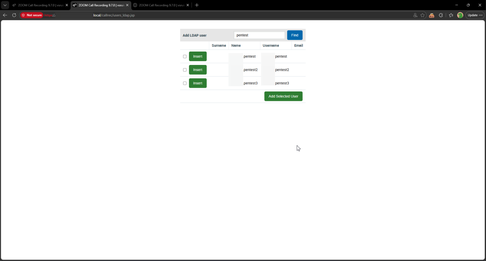

# Eleveo Call Recording Software 9.7.0 LDAP User Interface /callrec/users_ldap.jsp Improper Authorization

> - https://vuldb.com/vuln/377442
> - https://vuldb.com/submit/797459
> - https://www.cve.org/CVERecord?id=CVE-2026-15375

## Timeline

- 10/3/2026 - Initial contact with the vendor
- 14/3/2026 - A second attempt was made to contact the vendor; however, no response was received
- 5/4/2026 - The vulnerability was submitted to VulnDB for CVE assignment.
- 10/7/2026 - The CVE has been assigned and published.

## Software Details

| Key              | Value                                          |
| ---------------- | ---------------------------------------------- |
| Vendor Name      | Eleveo                                         |
| Software Name    | Call Recording Software                        |
| Software URL     | https://www.eleveo.com/call-recording-software |
| Affected Version | 9.7.0                                          |

## Description

A Broken Access Control vulnerability exists in /callrec/users_ldap.jsp endpoint of Eleveo Call Recording 9.7.0 which allows low-privileged authenticated users, including those without “Users and Roles” privilege, to retrieve a list of directory users. The backend does not properly enforce role-based access control, allowing unauthorized users to access directory information that should be restricted to administrative users. Retrieved details include usernames, email addresses, first names, and last names.

## Implications

- Disclosure of sensitive directory information including usernames, email addresses, and full names.
- Facilitation of targeted attacks such as phishing, social engineering, or brute-force login attempts using harvested user information.

## Vulnerability Type

Broken Access Control / Improper Authorization

## Steps to Reproduce

1. Login as a low-privilege user with no “**Users and Roles**” privilege

2. Navigate to https://example.local/callrec/users_ldap.jsp

