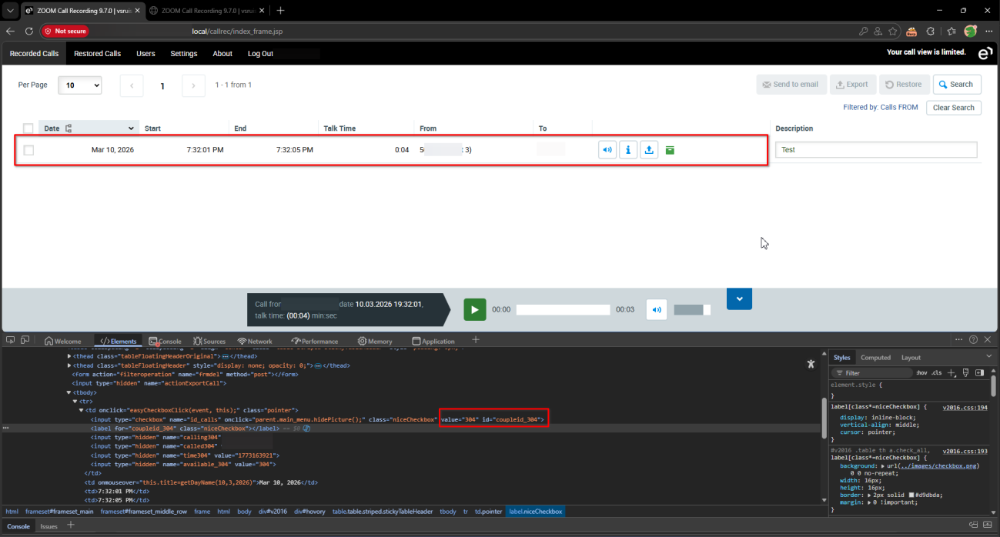
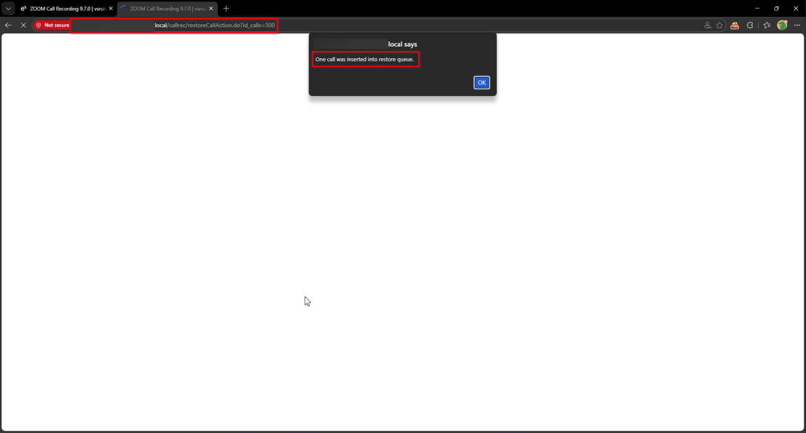
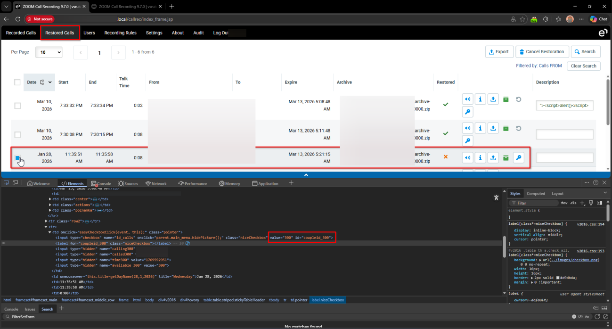

# Eleveo Call Recording Software 9.7.0 Recorded Calls Page restoreCallAction.do Improper Authorization

> - https://vuldb.com/vuln/377778
> - https://vuldb.com/submit/797466
> - https://www.cve.org/CVERecord?id=CVE-2026-15473

## Timeline

- 10/3/2026 - Initial contact with the vendor
- 14/3/2026 - A second attempt was made to contact the vendor; however, no response was received
- 5/4/2026 - The vulnerability was submitted to VulnDB for CVE assignment.
- 11/7/2026 - The CVE has been assigned and published.

## Software Details

| Key              | Value                                          |
| ---------------- | ---------------------------------------------- |
| Vendor Name      | Eleveo                                         |
| Software Name    | Call Recording Software                        |
| Software URL     | https://www.eleveo.com/call-recording-software |
| Affected Version | 9.7.0                                          |

## Description

A Broken Access Control vulnerability exists in /callrec/restoreCallAction.do endpoint of Eleveo Call Recording 9.7.0, which allows low-privileged authenticated users to bypass administrator-defined access filters and restore call recordings that should not be accessible to them. Although administrators can configure filters to restrict which call recordings a user may access, the backend does not properly enforce these restrictions when processing restore requests. By invoking the affected endpoint, a user can restore recordings that fall outside the scope of their permitted filters, effectively bypassing the intended access controls.

## Implications

Unauthorized restoration of restricted call recordings, allowing users to access recordings that should remain inaccessible according to administrator-defined filters.

## Vulnerability Type

Broken Access Control / Improper Authorization

## Steps to Reproduce

1. Login as an **admin** user, then navigate to **Users**
2. Apply a search filter that only allows the restricted user to see calls with **Description = Test**

3. Login as the restricted user and navigate to **Recorded Calls**. Only one call (ID **304**) is shown. Observe that even if the user changes the search filters, no other calls are displayed, and the header indicates limited access

4. Directly navigate to https://example.local/callrec/restoreCallAction.do?id_calls=300
5. Observe that the call with ID 300 is restored successfully, even though it is outside the restricted filter

