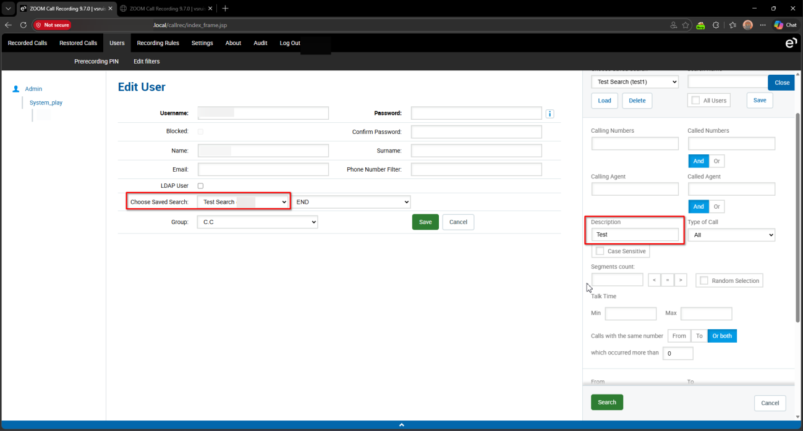
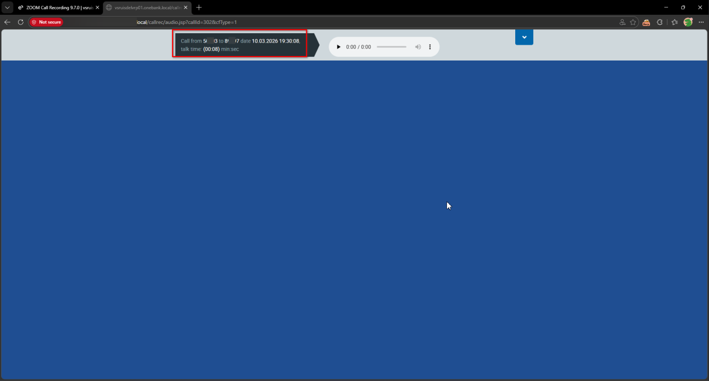

# Eleveo Call Recording Software 9.7.0 /callrec/audio.jsp callId Improper Authorization

> - https://vuldb.com/vuln/377779
> - https://vuldb.com/submit/797469
> - https://www.cve.org/CVERecord?id=CVE-2026-15474

## Timeline

- 10/3/2026 - Initial contact with the vendor
- 14/3/2026 - A second attempt was made to contact the vendor; however, no response was received
- 5/4/2026 - The vulnerability was submitted to VulnDB for CVE assignment.
- 11/7/2026 - The CVE has been assigned and published.

## Software Details

| Key              | Value                                          |
| ---------------- | ---------------------------------------------- |
| Vendor Name      | Eleveo                                         |
| Software Name    | Call Recording Software                        |
| Software URL     | https://www.eleveo.com/call-recording-software |
| Affected Version | 9.7.0                                          |

## Description

A Broken Access Control vulnerability exists in /callrec/audio.jsp endpoint of Eleveo Call Recording 9.7.0, which allows low-privileged authenticated users to bypass administrator-defined access filters and access metadata related to call recordings. Although administrators can configure filters to restrict which call recordings a user may access, the backend does not properly enforce these restrictions when processing certain audio playback requests. By invoking the affected endpoint directly, a user can retrieve recording metadata that falls outside the scope of their permitted filters, thereby bypassing the intended access controls.

## Implications

Unauthorized access to restricted call recording metadata, allowing users to retrieve information about recordings that should remain inaccessible according to administrator-defined filters.

## Vulnerability Type

Broken Access Control / Improper Authorization

## Steps to Reproduce

1. Login as an **Admin** user, and apply a filter that only allows a restricted user to see calls with **Description = Test**

2. Login as the restricted user and navigate to **Recorded Calls**. Only one call (ID 304) is displayed.

3. Directly navigate to the audio metadata endpoint specifying a call outside the filter: https://example.local/callrec/audio.jsp?callId=302&cfType=1
4. Observe that the system returns the audio metadata, including **caller**, **calling** numbers, **date**, and **talking time**

