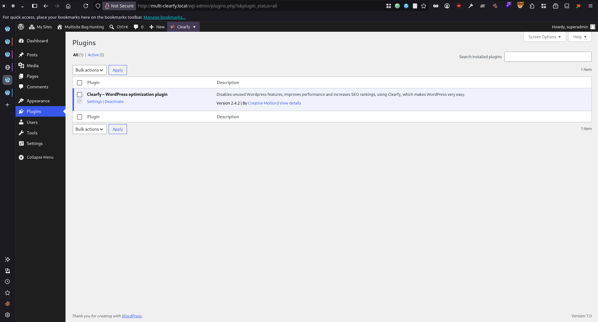
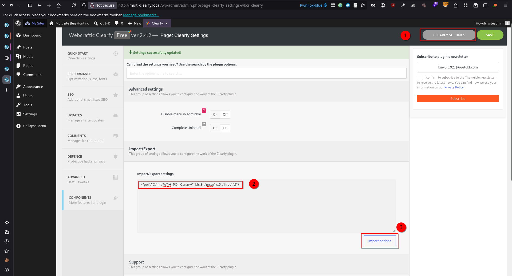
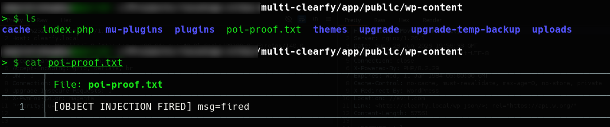

# Clearfy < 2.4.3 - Admin+ PHP Object Injection via Settings Import

> - https://wpscan.com/vulnerability/3daf62cd-eefe-49ec-89f7-b13f88111853/
> - https://www.cve.org/CVERecord?id=CVE-2026-16297

## Timeline

- 28/6/2026 - Submission to WPScan
- 20/7/2026 - WPScan verified the submission and assigned CVE-2026-16297
- 24/7/2026 - WPScan disclosed the vulnerability description
- 7/8/2026 - WPScan disclosed the PoC

## Software Details

| Key              | Value                                                                       |
| ---------------- | --------------------------------------------------------------------------- |
| Software Name    | Clearfy Cache – WordPress optimization plugin, Minify HTML, CSS & JS, Defer |
| Software Slug    | clearfy                                                                     |
| Software URL     | https://wordpress.org/plugins/clearfy/                                      |
| Affected Version | <= 2.4.2                                                                    |

## Description

A PHP Object Injection vulnerability exists in the Clearfy Cache – WordPress optimization plugin, Minify HTML, CSS & JS, Defer plugin for WordPress (through version 2.4.2), within the settings import feature. The vulnerability is caused by calling `unserialize()` on attacker-controlled input with no `allowed_classes` restriction in the `wbcr_clearfy_import_settings()` AJAX handler in `admin/ajax/import-settings.php`. The handler reads the settings POST field, JSON-decodes it via `WCL_Helper::maybeGetPostJson()`, then iterates the resulting array and passes any value that satisfies `is_serialized()` directly to `unserialize()` (line 61). Because no `['allowed_classes' => false]`option is supplied, an attacker who controls the serialized string can force instantiation of arbitrary already-loaded PHP classes and trigger their magic methods (`__wakeup`/`__destruct`/etc.) at unserialization time, before any subsequent sanitization runs. The handler is gated by a nonce (`check_ajax_referer('wbcr_clearfy_import_options')`) and a capability check (`WCL_Plugin::app()->currentUserCan()`), so it is reachable by authenticated administrators. Crucially, `currentUserCan()` requires `manage_network` only when the plugin is network-activated; on a per-site-activated multisite the required capability drops to `manage_options`, which a non-super Site Admin holds — a role that WordPress deliberately denies code-execution privileges (no plugin/theme installation, file editing disabled network-wide). Clearfy ship no gadget of their own, so weaponization to RCE is contingent on a POP gadget chain present elsewhere in the runtime (WordPress core or another active plugin/theme).

## Implications

On a per-site-activated multisite, this endpoint is reachable by a non-super Site Admin (manage_options) — a role WordPress intentionally bars from running PHP. The unrestricted unserialize() gives that role an object-injection primitive which, combined with a POP gadget chain present in the environment (e.g. a co-installed plugin/theme), escalates to remote code execution as the web user. 


## Vulnerability Type

PHP Object Injection w/o gadget

## Authentication Level Required

Site Admin+ (manage_options; non-super Site Admin on per-site-activated multisite - a privilege boundary. manage_network/super admin when network-activated.)

## PoC Video

https://github.com/user-attachments/assets/8fbb8448-e430-4a79-850f-832efd8f171b


## References to Affected Code

1. **Sink**: unrestricted `unserialize()` on attacker-controlled, JSON-decoded POST data. The value of each settings entry that passes `is_serialized()` is unserialized with no `allowed_classes` guard, so object instantiation and magic-method execution happen here, before the `recursiveSanitizeArray`/`wp_kses_post` cleanup that follows:
> https://plugins.trac.wordpress.org/browser/clearfy/tags/2.4.2/admin/ajax/import-settings.php#L61
```php  
// line 17 — handler; registered wp_ajax_* only (line 151)
function wbcr_clearfy_import_settings()
{
    global $wpdb;

    check_ajax_referer('wbcr_clearfy_import_options');           // nonce gate (line 21)

    if( !WCL_Plugin::app()->currentUserCan() ) {                 // capability gate (line 22)
        wp_send_json_error(array('error_message' => __('You don\'t have enough capability to edit this information.', 'clearfy')));
        die();
    }

    $settings = WCL_Helper::maybeGetPostJson('settings');        // json_decode($_POST['settings']) (line 28)
    ...
    foreach($settings as $option_name => $option_value) {
        $option_name = sanitize_text_field($option_name);
        $raw_option_value = $option_value;

        if( is_serialized($option_value) ) {
            $option_value = unserialize($option_value);          // SINK (line 61) — missing allowed_classes => false
        }
        ...
    }
}
...
add_action('wp_ajax_wbcr-clearfy-import-settings', 'wbcr_clearfy_import_settings'); // line 151
```  
  
2. **Source**: fully attacker-controlled input. `maybeGetPostJson()` JSON-decodes the raw settings POST field into an associative array; each string value flows unmodified into the `is_serialized()`/`unserialize()` branch above, so the serialized payload is entirely attacker-defined:
> https://plugins.trac.wordpress.org/browser/clearfy/tags/2.4.2/includes/helpers.php#L273
```php  
public static function maybeGetPostJson($name)
{
    if( isset($_POST[$name]) and is_string($_POST[$name]) ) {
        $result = json_decode(stripslashes($_POST[$name]), true); // attacker-controlled JSON -> array
        if( !is_array($result) ) {
            $result = array();
        }

        return $result;
    } else {
        return array();
    }
}
```  

3. Privilege-boundary downgrade — capability requirement depends on activation mode. When the plugin is not network-activated (the per-site multisite case), the required capability is `manage_options`, which a non-super Site Admin holds:
> https://plugins.trac.wordpress.org/browser/clearfy/tags/2.4.2/includes/class.plugin.php#L266
```php
public function currentUserCan() {
    $permission = $this->isNetworkActive() ? 'manage_network' : 'manage_options';
    
    return current_user_can( $permission );
}
```

## Remediation

Update the plugin to version 2.4.3 or later.

## Preconditions

1. Setup WordPress Multisite environment with (PHP v8.2.29, MySQL 8.0.35, and WordPress 7.0)
2. Clearfy Cache – WordPress optimization plugin, Minify HTML, CSS & JS, Defer plugin is installed
3. The plugin is activated on the site for which the attacker has **Site Admin** privileges



4. A plugin or theme installed on the WordPress instance contains a suitable POP gadget chain. For demonstration purposes, the following PHP code is placed in `wp-content/mu-plugins/poi-canary.php` to provide a minimal gadget for the proof of concept.
```php
<?php
class WPH_POI_Canary {
    public $msg;
    public function __wakeup() {
        file_put_contents(WP_CONTENT_DIR . '/poi-proof.txt', '[OBJECT INJECTION FIRED] msg=' . $this->msg . "\n", FILE_APPEND);
    }
}
```

## Steps to Reproduce

1. Login as **Site Admin**, and navigate to **Settings** > **Clearfy** > **Clearfy Settings**, insert the following object into the import/export field, then click **Import options**
```php
{"poi":"O:14:\"WPH_POI_Canary\":1:{s:3:\"msg\";s:5:\"fired\";}"}
```



2. Observe that the object injection was successful by confirming that the file `poi-proof.txt` has been created in the `wp-content` directory.


