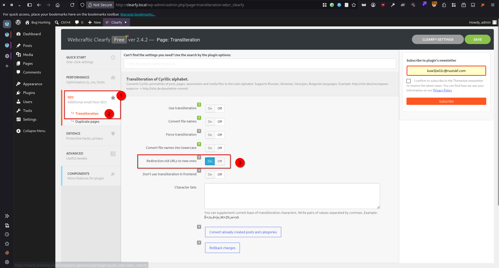
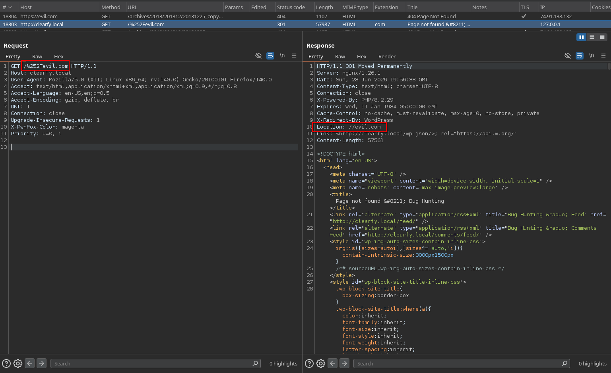

# Clearfy < 2.4.3 - Open Redirect via Cyrlitera 404 Handler

> - https://wpscan.com/vulnerability/265f2edb-1c86-4b87-a59f-d5de5bf21494/

## Timeline

- 28/6/2026 - Submission to WPScan
- 29/6/2026 - WPScan set the submission as Duplicate
- 27/7/2026 - WPScan published the primary entry under CVE-2026-16296

## Software Details

| Key              | Value                                                                       |
| ---------------- | --------------------------------------------------------------------------- |
| Software Name    | Clearfy Cache – WordPress optimization plugin, Minify HTML, CSS & JS, Defer |
| Software Slug    | clearfy                                                                     |
| Software URL     | https://wordpress.org/plugins/clearfy/                                      |
| Affected Version | <= 2.4.2                                                                    |

## Description

An open redirect vulnerability exists in the Clearfy Cache – WordPress optimization plugin, Minify HTML, CSS & JS, Defer plugin for WordPress (through version 2.4.2), within the Cyrlitera component's "Redirect from old URLs" feature. The vulnerability is caused by improper validation of the request URI in the `redirectFromOldUrls()` function in components/cyrlitera/includes/classes/class-configurate-cyrlitera.php, which URL-decodes `$_SERVER['REQUEST_URI']`, transliterates it, and passes the result directly to `wp_redirect()` instead of `wp_safe_redirect()`, performing no host validation on the destination. An attacker can supply a crafted 404 path that decodes to a protocol-relative URL (for example `/%252Fevil.com/test`, which the plugin's double URL-decoding resolves to `//evil.com/test`), causing the application to issue a 301 redirect to an arbitrary external domain. This issue can be exploited by unauthenticated attackers and results in redirection of victims who visit the crafted link to an attacker-controlled website, enabling phishing and theft of redirect-based OAuth/SSO credentials. Exploitation requires the "Redirect from old URLs" option to be enabled.

## Implications

Any unauthenticated remote visitor who can get a victim to click a link on the victim's own domain can redirect that victim to an arbitrary attacker-controlled domain. This enables convincing phishing (the link legitimately begins with the trusted victim.com host), and serves as a primitive for higher-impact chains — most notably theft of OAuth/SSO redirect_uri tokens and authorization codes, and bypass of redirect-based allow-list controls.

## Vulnerability Type

Open Redirect

## Authentication Level Required

Unauthenticated

## PoC Video

https://github.com/user-attachments/assets/3d05f717-3677-40bc-abcf-b3848777947a


## References to Affected Code

1. **Sink**: unvalidated `wp_redirect()` on the public wp hook. `redirectFromOldUrls()` is registered on the front-end wp action and decodes `$_SERVER['REQUEST_URI']`, transliterates it, lowercases it, and redirects with `wp_redirect()` (not wp_safe_redirect()) whenever the result differs from the input:
> https://plugins.trac.wordpress.org/browser/clearfy/tags/2.4.2/components/cyrlitera/includes/classes/class-configurate-cyrlitera.php#L237
```php  
// line 40 — public, unauthenticated hook registration
add_action( 'wp', [ $this, 'redirectFromOldUrls' ], $this->wpForoIsActivated() ? 11 : 10 );
...
public function redirectFromOldUrls() {
    if ( ! WBCR\Factory_Templates_134\Helpers::isPermalink() ) {
        return;
    }
    $is404 = is_404();
    ...
    if ( $is404 ) {
        if ( $this->getPopulateOption( 'redirect_from_old_urls' ) ) {
            $current_url = urldecode( $_SERVER['REQUEST_URI'] );          // 1st decode
            $new_url     = WCTR_Helper::transliterate( $current_url, true ); // 2nd decode inside
            $new_url     = strtolower( $new_url );

            if ( $current_url != $new_url ) {
                wp_redirect( $new_url, 301 ); // no host validation — should be wp_safe_redirect()
            }
        }
    }
}
```  
  
2. **Double decode amplifier** — second `urldecode()` in the transliterator. `WCTR_Helper::transliterate()` decodes the value a second time before any character mapping, so the input is effectively double-decoded relative to `$current_url`. This is what lets `%252F` collapse to a literal `/` after the server has already passed it through untouched:
> https://plugins.trac.wordpress.org/browser/clearfy/tags/2.4.2/components/cyrlitera/includes/class-helpers.php#L18 
```php  
public static function transliterate( $title, $ignore_special_symbols = false ) {
	$origin_title = $title;
	$iso9_table   = self::getSymbolsPack();

	$title = urldecode( $title ); // 2nd urldecode — enables double-encoded bypass
	$title = strtr( $title, $iso9_table );

	if ( function_exists( 'iconv' ) ) {
		$title = iconv( 'UTF-8', 'UTF-8//TRANSLIT//IGNORE', $title );
	}

    // $ignore_special_symbols === true, so the preg_replace cleanup below is skipped,
    // leaving "/" and "." intact in the output
	if ( ! $ignore_special_symbols ) {
		$title = preg_replace( "/[^A-Za-z0-9'_\-\.]/", '-', $title );
		$title = preg_replace( '/\-+/', '-', $title );
		$title = preg_replace( '/^-+/', '', $title );
		$title = preg_replace( '/-+$/', '', $title );
	}

	return apply_filters( 'wbcr_cyrlitera_transliterate', $title, $origin_title, $iso9_table );
}
```  
  

## Remediation

Update the plugin to version 2.4.3 or later.

## Preconditions

1. Setup WordPress environment with (PHP v8.2.29, MySQL 8.0.35, and WordPress 7.0)
2. Clearfy Cache – WordPress optimization plugin, Minify HTML, CSS & JS, Defer plugin is installed
3. From **Settings** > **Clearfy** > **Components**, activate **Transliteration of Cyrillic alphabet**


4. From **Settings** > **Clearfy** > **SEO** > **Transliteration**, enable **Redirection old URLs to new ones**




## Steps to Reproduce

Navigate to http://clearfy.local/%252Fevil.com, and observe the user will be redirected to evil.com


