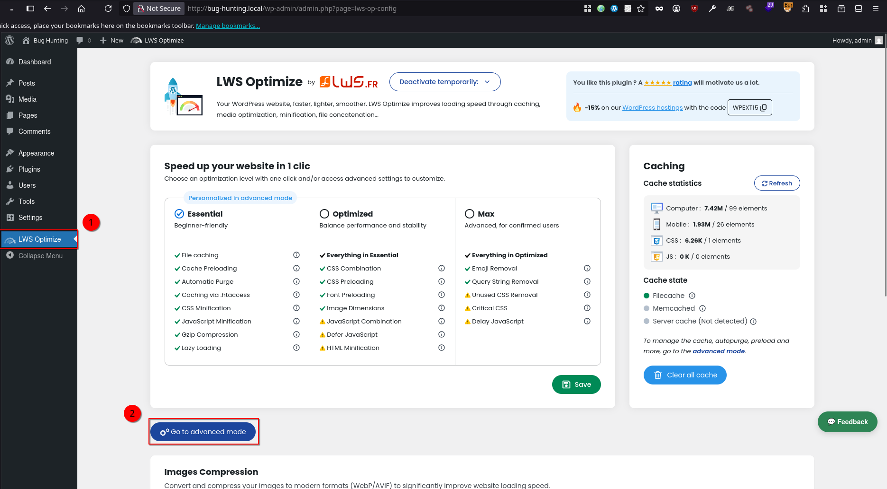
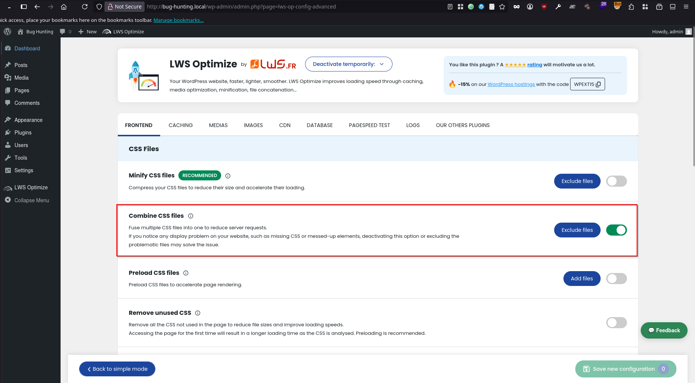
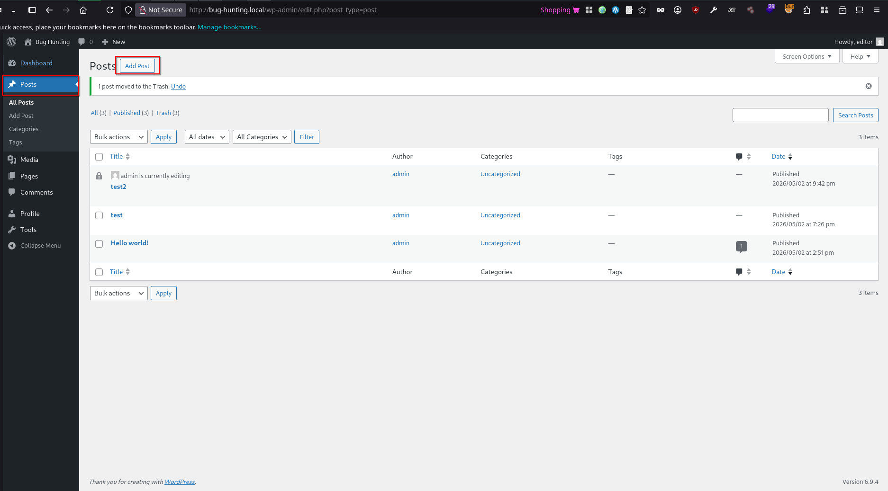
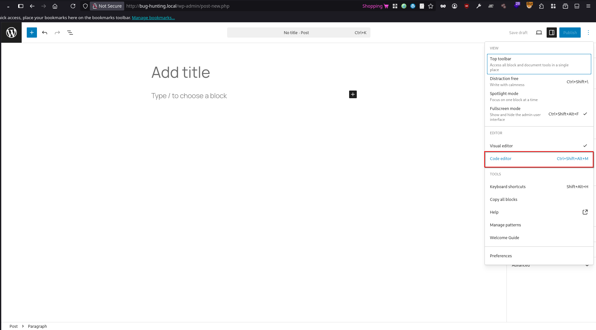
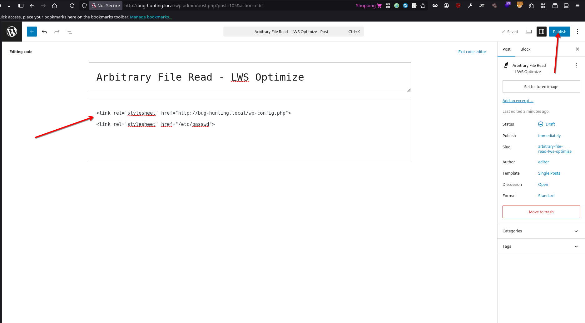
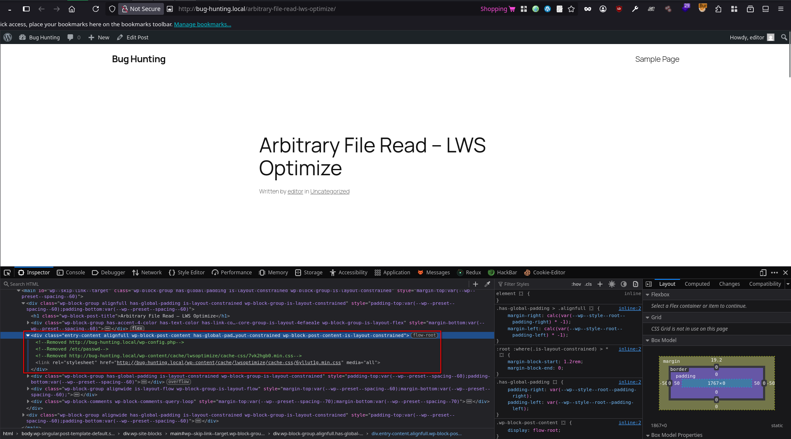
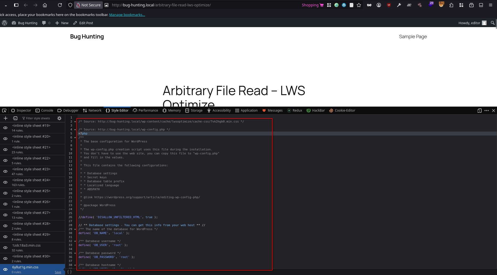
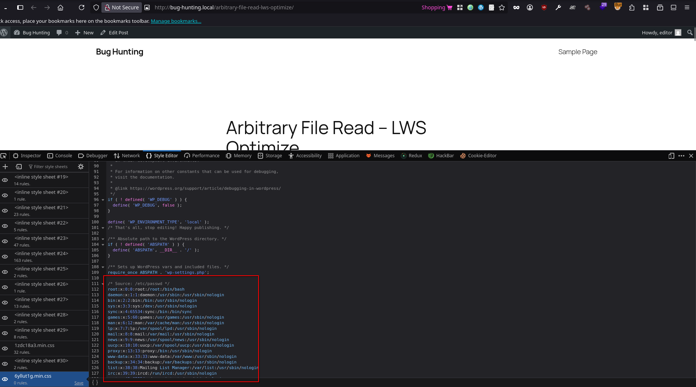

# WS Optimize – All-in-One Speed Booster & Cache Tools <= 3.3.19 - Authenticated (Editor+) Arbitrary File Read

> - https://www.wordfence.com/threat-intel/vulnerabilities/wordpress-plugins/lws-optimize/ws-optimize-all-in-one-speed-booster-cache-tools-3319-authenticated-editor-arbitrary-file-read
> - https://www.cve.org/CVERecord?id=CVE-2026-12089

## Timeline

- 3/5/2026 - Initial contact with the vendor via the website contact form.
- 4/5/2026 - The vendor released a patched version of the plugin (v3.3.20).
- 4/5/2026 - The vulnerability was submitted to Wordfence for CVE assignment.
- 12/6/2026 - The CVE has been assigned and published.

## Software Details

| Key              | Value                                                |
| ---------------- | ---------------------------------------------------- |
| Software Name    | WS Optimize – All-in-One Speed Booster & Cache Tools |
| Software Slug    | lws-optimize                                         |
| Software URL     | https://wordpress.org/plugins/lws-optimize/          |
| Affected Version | <= 3.3.19                                            |
## Description

An arbitrary file read vulnerability (and a limited SSRF) exists in the LWS Optimize WordPress plugin within the CSS/JS combination feature (`combine_current_css()` and `combine_current_js()`). An authenticated user with Editor-level privileges or higher can exploit this issue by injecting a crafted `<link>` or `<script>` tags into a post or page. By manipulating the `href` or `src` attributes, the plugin may be induced to process and retrieve local files from the server. This can allow an attacker to access sensitive files such as `wp-config.php` or other system files.

## Implications

- Successful exploitation of this vulnerability may expose sensitive configuration data, including database credentials and authentication secrets. Access to such information could enable further compromise of the application, including unauthorized database access, privilege escalation, and potential full site takeover.
- Ability to scan internal ports and access internal web services

## Vulnerability Type

Arbitrary File Read / Download


## Authentication Level Required

Editor+

## PoC Video

https://github.com/user-attachments/assets/d97af4d6-2d18-4ee2-b507-6e94d1dd53f8

## References to Affected Code

1. When the **Combine CSS files** or/and **Combine JS files** features are enabled, the `combine_css_update`, or/and `combine_js_update` methods are executed
> https://plugins.trac.wordpress.org/browser/lws-optimize/tags/3.3.19/Classes/FileCache/LwsOptimizeFileCache.php#L264
```php
...
if ($this->base->lwsop_check_option('combine_css')['state'] == "true") {
	if ($this->base->lwsop_check_option('minify_css')['state'] == "true") {
		$lwsOptimizeCssManager = new LwsOptimizeCSSManager($modified, [], [], $media_to_update, true);
		$data = $lwsOptimizeCssManager->combine_css_update(true);
	} else {
		$lwsOptimizeCssManager = new LwsOptimizeCSSManager($modified, [], [], $media_to_update);
		$data = $lwsOptimizeCssManager->combine_css_update();
	}

	$modified = $data['html'];

	$cached_elements['css']['file'] += $data['files']['file'];
	$cached_elements['css']['size'] += $data['files']['size'];
}
...
```

> https://plugins.trac.wordpress.org/browser/lws-optimize/tags/3.3.19/Classes/FileCache/LwsOptimizeFileCache.php#L288
```php
 ...
 if ($this->base->lwsop_check_option('combine_js')['state'] == "true") {
	if ($this->base->lwsop_check_option('minify_js')['state'] == "true") {
		$lwsOptimizeJsManager = new LwsOptimizeJSManager($modified, true);
		$data = $lwsOptimizeJsManager->combine_js_update();
	} else {
		$lwsOptimizeJsManager = new LwsOptimizeJSManager($modified);
		$data = $lwsOptimizeJsManager->combine_js_update();
	}

	$modified = $data['html'];

	$cached_elements['js']['file'] += $data['files']['file'];
	$cached_elements['js']['size'] += $data['files']['size'];
}
...
```

2. The `combine_css_update` method scans the page for all `<link>` tags and extracts their `href` attributes, which are then passed to the `combine_current_css` method for processing. The same for `combine_js_update` method that scans the page for all `<script>` tags and extracts their `src` attributes, which are then passed to the `combine_current_js` method for processing.
> https://plugins.trac.wordpress.org/browser/lws-optimize/tags/3.3.19/Classes/Front/LwsOptimizeCSSManager.php#L41
```php
...
public function combine_css_update()
{
	if (empty($this->content)) {
		return false;
	}

	// Get all <link> and <style> tags
	preg_match_all("/(<link\s*[^>]*+>|<style\s*.*?<\/style>)/xs", $this->content, $matches);

	$current_links = [];
	$current_media = false;

	$elements = $matches[0];
	// Loop through each tag
	foreach ($elements as $key => $element) {
		// If it is a <link>, get the attributes and proceed with the verifications
		// If the <link> is to be combined, add it to the current array
		// Once we reach an incompatible <link> or a <style>, we combine the <link> and empty the array to start again with another batch of <link>
		if (substr($element, 0, 5) == "<link") {
			preg_match("/media\=[\'\"]([^\'\"]+)[\'\"]/", $element, $media);
			preg_match("/href\=[\'\"]([^\'\"]+)[\'\"]/", $element, $href);
			preg_match("/rel\=[\'\"]([^\'\"]+)[\'\"]/", $element, $rel);
			preg_match("/type\=[\'\"]([^\'\"]+)[\'\"]/", $element, $type);

			$media[1] = $media[1] ?? "all";
			$href[1] = $href[1] ?? "";
			$rel[1] = $rel[1] ?? "";
			$type[1] = $type[1] ?? "";
...
```

> https://plugins.trac.wordpress.org/browser/lws-optimize/tags/3.3.19/Classes/FileCache/LwsOptimizeFileCache.php#L288
```php
...
public function combine_js_update()
{
	if (empty($this->content)) {
		return false;
	}

	// Get all <script> tags
	preg_match_all("/(<script\s*.*?<\/script>)/xs", $this->content, $matches);

	$current_scripts = [];
	$ids = "";

	$elements = $matches[0];
	
	// Loop through each tag
	foreach ($elements as $key => $element) {
		if (substr($element, 0, 7) == "<script") {

			preg_match("/src\=[\'\"]([^\'\"]+)[\'\"]/", $element, $src);
			preg_match("/id\=[\'\"]([^\'\"]+)[\'\"]/", $element, $id);


			// Ignore <script> tags with type="module"
			preg_match('/type\s*=\s*[\'"]([^\'"]+)[\'"]/', $element, $type_match);
			$script_type = isset($type_match[1]) ? strtolower(trim($type_match[1])) : '';
			if ($script_type === 'module') {
				continue;
			}

			$src = $src[1] ?? "";
			$id = $id[1] ?? "";

			$id = trim($id);
			$src = trim($src);
...
```


3. The `combine_current_css` and `combine_current_js` methods, which contain the vulnerability, iterates over the extracted links and handles them based on their format. If a link begins with `//`, it is prefixed with either `http` or `https` and fetched remotely, which may lead to issues such as real IP exposure. Otherwise, the method treats the input as a local file path and reads it directly from the filesystem without enforcing any directory restrictions. Additionally, URLs starting with the site’s base URL (e.g., `http://site.com/`) are transformed into local filesystem paths relative to the web root, allowing access to files within the application directory without requiring knowledge of their exact location.

> https://plugins.trac.wordpress.org/browser/lws-optimize/tags/3.3.19/Classes/Front/LwsOptimizeCSSManager.php#L220
```php
...
$file_path = $link;
$file_path = str_replace(get_site_url() . "/", ABSPATH, $file_path);
$file_path = explode("?ver", $file_path)[0];
// If path starts with "//", remove them
if (substr($file_path, 0, 2) === "//") {
	$file_path = substr($file_path, 2);
	// Add http: or https: based on site settings
	$file_path = (is_ssl() ? 'https:' : 'http:') . '//' . $file_path;
	$file_path = str_replace(get_site_url() . "/", ABSPATH, $file_path);
}
// Handle remote URLs (like CDN content)
error_log($file_path);
if (strpos($file_path, 'http') === 0) {
	$content = @file_get_contents($file_path);
	if ($content !== false) {
		$name = base_convert(crc32($name . $link), 20, 36);
		if ($this->minify) {
			$minify->add($content);
		} else {
			$full_content .= "\n/* Source: $link */\n" . $content;
		}
	} else {
		// If we can't fetch the remote file, add it to problematic files
		$problematic_files[] = $link;
		$retry_needed = true;
		error_log('LwsOptimize: Could not fetch remote CSS file: ' . $file_path);
		continue;
	}
} else {
	if (file_exists($file_path)) {
		
		if ($this->minify) {
			$minify->add($file_path);
		} else {
			$full_content .= "\n/* Source: $link */\n" . file_get_contents($file_path);
		}
		$name = base_convert(crc32($name . $link), 20, 36);
	}
}
...
```

> https://plugins.trac.wordpress.org/browser/lws-optimize/tags/3.3.19/Classes/Front/LwsOptimizeJSManager.php#L184
```php
$file_path = $script;
$file_path = str_replace(get_site_url() . "/", ABSPATH, $file_path);
$file_path = explode("?", $file_path)[0];

// If path starts with "//", handle protocol-relative URLs
if (substr($file_path, 0, 2) === "//") {
	$file_path = substr($file_path, 2);
	// Add http: or https: based on site settings
	$file_path = (is_ssl() ? 'https:' : 'http:') . '//' . $file_path;
	$file_path = str_replace(get_site_url() . "/", ABSPATH, $file_path);
}

// Handle remote URLs (like CDN content)
if (strpos($file_path, 'http') === 0) {
	$content = @file_get_contents($file_path);
	if ($content !== false) {
		// Ensure proper JavaScript termination
		$processed_content = $this->ensureProperJSTermination($content);

		if ($this->minify) {
			// Replace both http:// and https:// with their escaped versions
			$processed_content = preg_replace('#http://#', 'http:\/\/', $processed_content);
			$processed_content = preg_replace('#https://#', 'https:\/\/', $processed_content);
			$minify->add($processed_content);
		} else {
			$full_content .= "\n/* Source: $script */\n" . $processed_content;
		}
		$name = base_convert(crc32($name . $script), 20, 36);
	} else {
		// If we can't fetch the remote file, add it to problematic files
		$problematic_files[] = $script;
		$retry_needed = true;
		error_log('LwsOptimize: Could not fetch remote JS file: ' . $file_path);
		continue;
	}
} else {
	if (file_exists($file_path)) {
		$content = file_get_contents($file_path);

		// Ensure proper JavaScript termination
		$processed_content = $this->ensureProperJSTermination($content);

		if ($this->minify) {
			// Replace both http:// and https:// with their escaped versions
			$processed_content = preg_replace('#http://#', 'http:\/\/', $processed_content);
			$processed_content = preg_replace('#https://#', 'https:\/\/', $processed_content);
			$minify->add($processed_content);
		} else {
			$full_content .= "\n/* Source: $script */\n" . $processed_content;
		}
		$name = base_convert(crc32($name . $script), 20, 36);

    } else {
		$problematic_files[] = $script;
		$retry_needed = true;
		error_log('LwsOptimize: Could not find JS file: ' . $file_path);
		continue;
	}
}
```

## Recommended Patch

- Restrict file access to only the intended web-accessible directories, such as `wp-content/`, to prevent unauthorized file access outside the application scope. Additionally, implement strict validation to ensure that only legitimate CSS/JS files are processed and included in the final combined output, verifying both file type and content before aggregation.
- Validate the target URL before fetching any remote resource. Resolve the hostname to an IP address and verify that it does not fall within private or reserved ranges. Requests to such addresses should be rejected. 

## Remediation

Update the plugin to version 3.3.20 or later.


## Preconditions


1. Setup WordPress enviornment with (PHP v8.2.29, MySQL 8.0.35, and WordPress 6.9.4)
2. WS Optimize – All-in-One Speed Booster & Cache Tools plugin is installed
3. **Combine CSS files** feature is enabled






## Steps to Reproduce

1. Login with a user that has Editor privilege or higher, navigate to **Posts**, then click **Add Post**



2. Add a **Custom HTML** block, or enter the **Code editor**



3. Enter the following into the HTML field, which will read the content of both `wp-config.php`, and `/etc/passwd` files and combine them in single css/ file that will be served publiclly later. Then click **Publish**
```html
<link rel='stylesheet' href="http://bug-hunting.local/wp-config.php">
<link rel='stylesheet' href="/etc/passwd">
```



4. Navigate to the newly published post, and observe both `<link>` tags combined, into one `.min.css` file that contains the content of both `wp-config.php`, and `/etc/passwd` files confirming the arbitrary file read vulnerability.






