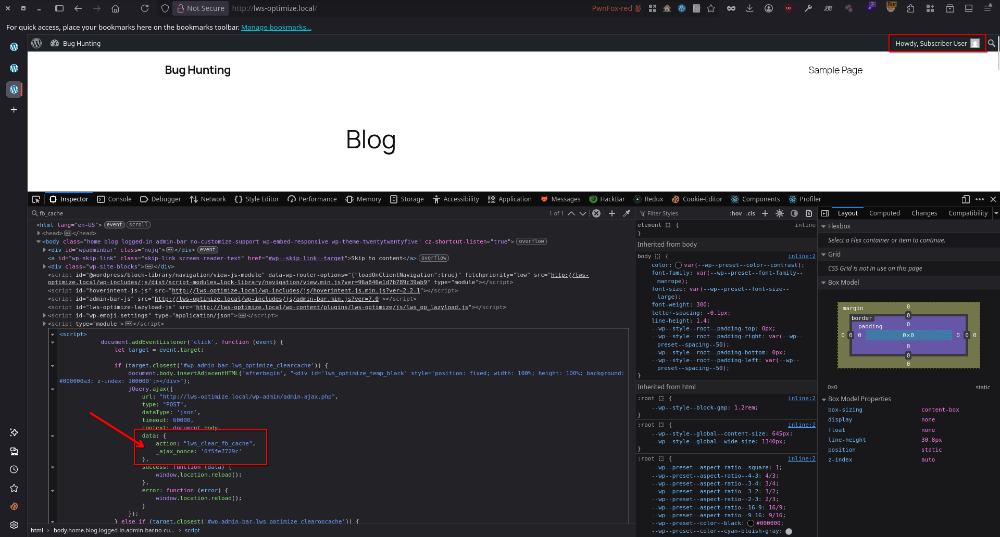
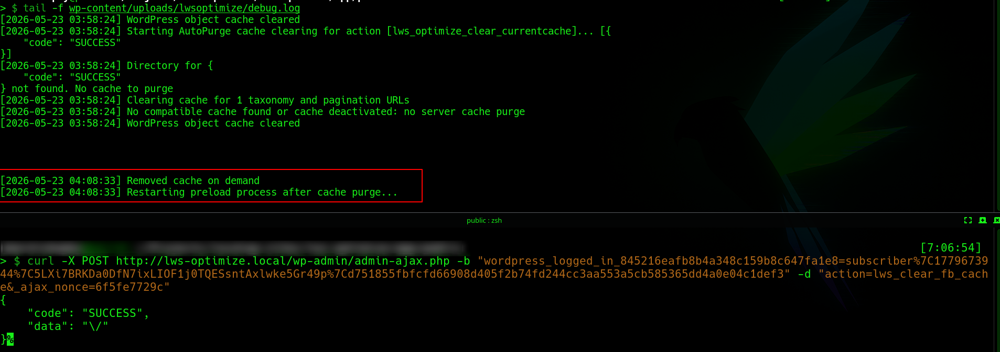

# LWS Optimize < 3.4 - Subscriber+ Cache Deletion

> - https://wpscan.com/vulnerability/0ea45a09-3155-4e47-97f7-f7645d583565
> - https://www.cve.org/CVERecord?id=CVE-2026-16042

## Timeline

- 23/5/2026 - Initial contact with the vendor via the security email
- 26/5/2026 - The vulnerability was submitted to WPScan for CVE assignment.
- 3/6/2026 - The vendor released a patched version of the plugin (v3.4).
- 17/7/2026 - WPScan verified the submission and assigned CVE-2026-16042
- 21/7/2026 - WPScan disclosed the vulnerability description
- 4/8/2026 - WPScan disclosed the PoC

## Software Details

| Key              | Value                                                |
| ---------------- | ---------------------------------------------------- |
| Software Name    | WS Optimize – All-in-One Speed Booster & Cache Tools |
| Software Slug    | lws-optimize                                         |
| Software URL     | https://wordpress.org/plugins/lws-optimize/          |
| Affected Version | < 3.4                                                |

## Description

A Missing Authorization vulnerability exists in the LWS Optimize WordPress plugin due to the AJAX handlers `lws_optimize_clear_cache`, `lws_clear_opcache`, `lws_optimize_clear_htmlcache`, `lws_optimize_clear_stylecache`, and `lws_optimize_clear_currentcache` do not enforce proper capability checks. As a result, authenticated users with Subscriber-level privileges or higher can clear various site caches, including OPCache, HTML cache, style cache, current page cache, and the entire cache.

An attacker with Subscriber-level access or above can obtain one of the exposed nonces (`clear_fb_caching`, `clear_opcache_caching`, `clear_html_fb_caching`, `clear_style_fb_caching`, or `clear_currentpage_fb_caching`) from the site footer, where they are registered for all authenticated users through the `lws_optimize_adminbar_scripts` method. The attacker can then issue a POST request to `wp-admin/admin-ajax.php` using one of the vulnerable AJAX actions along with the corresponding nonce to clear the site cache.

## Implications

- An attacker can repeatedly clear OPCache, HTML cache, style cache, or the full site cache, causing excessive regeneration of cached content and increased server resource consumption. This may degrade website performance or temporarily disrupt availability.
- Continuous cache invalidation forces the server to rebuild cached assets and pages, increasing CPU and memory usage and slowing down page load times for legitimate users.

## Vulnerability Type

Missing Authorization


## Authentication Level Required

Subscriber+


## PoC Video


## References to Affected Code

1. Although the plugin verifies `current_user_can('manage_options')` before adding cache-clearing menu items to the admin bar, it still exposes the nonces for the corresponding AJAX cache-clearing handlers after only checking `is_admin_bar_showing`. This condition is true for all authenticated users, including subscribers.
> https://plugins.trac.wordpress.org/browser/lws-optimize/tags/3.3.21/Classes/Admin/LwsOptimizeManageAdmin.php#L210
```php
...
public function lws_optimize_admin_bar(\WP_Admin_Bar $Wp_Admin_Bar)
{

	if (current_user_can('manage_options')) {
		$Wp_Admin_Bar->add_menu(
			[
				'id' => "lws_optimize_managecache",
				'parent' => null,
				'href' => esc_url(admin_url('admin.php?page=lws-op-config')),
				'title' => '<span class="lws_optimize_admin_icon">' . __('LWS Optimize', 'lws-optimize') . '</span>',
			]
		);
		$Wp_Admin_Bar->add_menu(
			[
				'id' => "lws_optimize_clearcache",
				'parent' => "lws_optimize_managecache",
				'title' => __('Clear all cache', 'lws-optimize')
			]
		);
		$Wp_Admin_Bar->add_menu(
			[
				'id' => "lws_optimize_clearopcache",
				'parent' => "lws_optimize_managecache",
				'title' => __('Clear OPcache', 'lws-optimize')
			]
		);
		if (!is_admin()) {
			$Wp_Admin_Bar->add_menu(
				[
					'id' => "lws_optimize_clearcache_page",
					'parent' => "lws_optimize_managecache",
					'title' => __('Clear current page cache files', 'lws-optimize')
				]
			);
		}
	}
}
...
```

> https://plugins.trac.wordpress.org/browser/lws-optimize/tags/3.3.21/Classes/Admin/LwsOptimizeManageAdmin.php#L144
```php
...
public function manage_options()
{
...
if (is_admin_bar_showing()) {
		add_action('admin_bar_menu', [$this, 'lws_optimize_admin_bar'], 300);
		add_action('admin_footer', [$this, 'lws_optimize_adminbar_scripts'], 300);
		add_action('wp_footer', [$this, 'lws_optimize_adminbar_scripts'], 300);
	}
}
...
```

2. The `lws_optimize_adminbar_scripts` function outputs the nonces for five AJAX handlers responsible for clearing the cache directly into the site footer.
> https://plugins.trac.wordpress.org/browser/lws-optimize/tags/3.3.21/Classes/Admin/LwsOptimizeManageAdmin.php#L249
```php
...
public function lws_optimize_adminbar_scripts()
{ ?>
	<script>
		document.addEventListener('click', function (event) {
			let target = event.target;

			if (target.closest('#wp-admin-bar-lws_optimize_clearcache')) {
				document.body.insertAdjacentHTML('afterbegin', "<div id='lws_optimize_temp_black' style='position: fixed; width: 100%; height: 100%; background: #000000a3; z-index: 100000';></div>");
				jQuery.ajax({
					url: "<?php echo esc_url(admin_url('admin-ajax.php')); ?>",
					type: "POST",
					dataType: 'json',
					timeout: 60000,
					context: document.body,
					data: {
						action: "lws_clear_fb_cache",
						_ajax_nonce: '<?php echo esc_attr(wp_create_nonce('clear_fb_caching')); ?>'
					},
					success: function (data) {
						window.location.reload();
					},
					error: function (error) {
						window.location.reload();
					}
				});
			} else if (target.closest('#wp-admin-bar-lws_optimize_clearopcache')) {
				document.body.insertAdjacentHTML('afterbegin', "<div id='lws_optimize_temp_black' style='position: fixed; width: 100%; height: 100%; background: #000000a3; z-index: 100000';></div>");
				jQuery.ajax({
					url: "<?php echo esc_url(admin_url('admin-ajax.php')); ?>",
					type: "POST",
					dataType: 'json',
					timeout: 60000,
					context: document.body,
					data: {
						action: "lws_clear_opcache",
						_ajax_nonce: '<?php echo esc_attr(wp_create_nonce('clear_opcache_caching')); ?>'
					},
					success: function (data) {
						window.location.reload();
					},
					error: function (error) {
						window.location.reload();
					}
				});
			} else if (target.closest('#wp-admin-bar-lws_optimize_clearcache_html')) {
				jQuery.ajax({
					url: "<?php echo esc_url(admin_url('admin-ajax.php')); ?>",
					type: "POST",
					dataType: 'json',
					timeout: 60000,
					context: document.body,
					data: {
						action: "lws_clear_html_fb_cache",
						_ajax_nonce: '<?php echo esc_attr(wp_create_nonce('clear_html_fb_caching')); ?>'
					},
					success: function (data) {
						window.location.reload();
					},
					error: function (error) {
						window.location.reload();
					}
				});
			} else if (target.closest('#wp-admin-bar-lws_optimize_clearcache_jscss')) {
				jQuery.ajax({
					url: "<?php echo esc_url(admin_url('admin-ajax.php')); ?>",
					type: "POST",
					dataType: 'json',
					timeout: 60000,
					context: document.body,
					data: {
						action: "lws_clear_style_fb_cache",
						_ajax_nonce: '<?php echo esc_attr(wp_create_nonce('clear_style_fb_caching')); ?>'
					},
					success: function (data) {
						window.location.reload();
					},
					error: function (error) {
						window.location.reload();
					}
				});
			} else if (target.closest('#wp-admin-bar-lws_optimize_clearcache_page')) {
				document.body.insertAdjacentHTML('afterbegin', "<div id='lws_optimize_temp_black' style='position: absolute; width: 100%; height: 100%; background: #000000a3; z-index: 100000';></div>");
				jQuery.ajax({
					url: "<?php echo esc_url(admin_url('admin-ajax.php')); ?>",
					type: "POST",
					dataType: 'json',
					timeout: 60000,
					context: document.body,
					data: {
						action: "lws_clear_currentpage_fb_cache",
						_ajax_nonce: '<?php echo esc_attr(wp_create_nonce('clear_currentpage_fb_caching')); ?>',
						request_uri: '<?php echo esc_url($_SERVER['REQUEST_URI']); ?>'
					},
					success: function (data) {
						window.location.reload();
					},
					error: function (error) {
						window.location.reload();
					}
				});
			}
		});
	</script>
	<?php
}
...
```

3. These AJAX handlers validate only the nonce and do not perform any additional capability checks, which allows any authenticated user to execute the cache-clearing actions.
> https://plugins.trac.wordpress.org/browser/lws-optimize/tags/3.3.21/Classes/Admin/LwsOptimizeManageAdmin.php#L1466
```php
...
public function lws_optimize_clear_cache()
{
	check_ajax_referer('clear_fb_caching', '_ajax_nonce');

	$this->lws_optimize_delete_directory(LWS_OP_UPLOADS, $GLOBALS['lws_optimize']);
...
```

> https://plugins.trac.wordpress.org/browser/lws-optimize/tags/3.3.21/Classes/Admin/LwsOptimizeManageAdmin.php#L1481
```php
public function lws_clear_opcache()
{
	check_ajax_referer('clear_opcache_caching', '_ajax_nonce');
	$this->lwsop_remove_opcache();
...
```

> https://plugins.trac.wordpress.org/browser/lws-optimize/tags/3.3.21/Classes/Admin/LwsOptimizeManageAdmin.php#L1488
```php
public function lws_optimize_clear_stylecache()
{
	check_ajax_referer('clear_style_fb_caching', '_ajax_nonce');
	$this->lws_optimize_delete_directory(LWS_OP_UPLOADS . "/cache-css", $this);
	$this->lws_optimize_delete_directory(LWS_OP_UPLOADS . "/cache-js", $this);
...
```

> https://plugins.trac.wordpress.org/browser/lws-optimize/tags/3.3.21/Classes/Admin/LwsOptimizeManageAdmin.php#L1501
```php
public function lws_optimize_clear_htmlcache()
{
	check_ajax_referer('clear_html_fb_caching', '_ajax_nonce');

	$this->lws_optimize_delete_directory(LWS_OP_UPLOADS . "/cache", $this);
	$this->lws_optimize_delete_directory(LWS_OP_UPLOADS . "/cache-mobile", $this);
...
```

> https://plugins.trac.wordpress.org/browser/lws-optimize/tags/3.3.21/Classes/Admin/LwsOptimizeManageAdmin.php#L1517
```php
public function lws_optimize_clear_currentcache()
{
	check_ajax_referer('clear_currentpage_fb_caching', '_ajax_nonce');

	// Get the request_uri of the current URL to remove
	// If not found, do not delete anything
	$uri = esc_url($_POST['request_uri']) ?? false;

	$logger = fopen($this->log_file, 'a');
	fwrite($logger, '[' . gmdate('Y-m-d H:i:s') . "] Starting to remove $uri cache" . PHP_EOL);
	fclose($logger);

	if ($uri === false) {
		wp_die(json_encode(array('code' => 'ERROR', 'data' => "/"), JSON_PRETTY_PRINT));
	}

	apply_filters("lws_optimize_clear_filebased_cache", $uri, "lws_optimize_clear_currentcache");

	wp_die(json_encode(array('code' => 'SUCCESS', 'data' => "/"), JSON_PRETTY_PRINT));
}
...
```


## Remediation

Update the plugin to version 3.4 or later.


## Preconditions

1. Setup WordPress environment with (PHP v8.2.29, MySQL 8.0.35, and WordPress 6.9.4)
2. WS Optimize – All-in-One Speed Booster & Cache Tools plugin is installed


## Steps to Reproduce

1. Log in using a user account with Subscriber privileges or higher, then navigate to the site homepage (or any public page) and extract the nonce(s) from the page HTML.



2. Use the extracted nonce to send a POST request to `/wp-admin/admin-ajax.php`, targeting the vulnerable AJAX action. Observe that the cache is successfully cleared upon execution.

```bash
curl -X POST http://lws-optimize.local/wp-admin/admin-ajax.php -b "<COOKIE>" -d "action=lws_clear_fb_cache&_ajax_nonce=<NONCE>"
```


